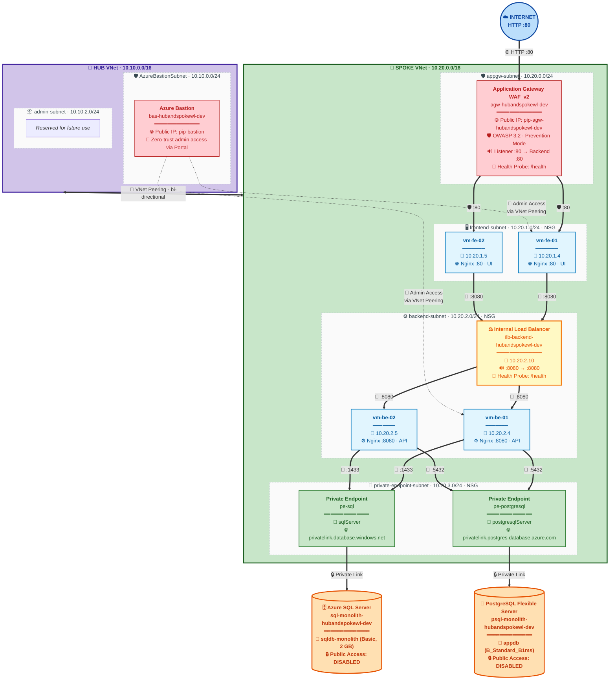
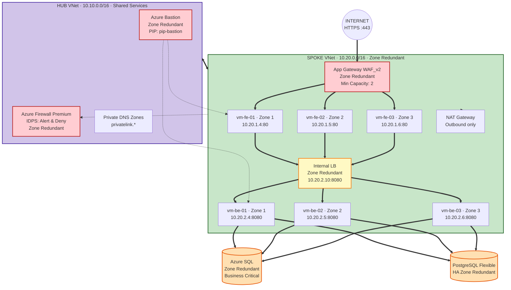
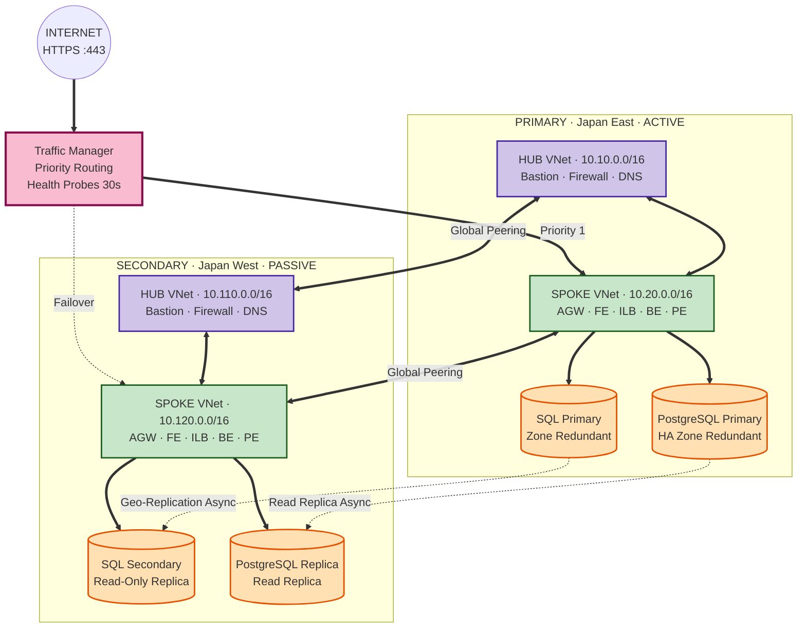
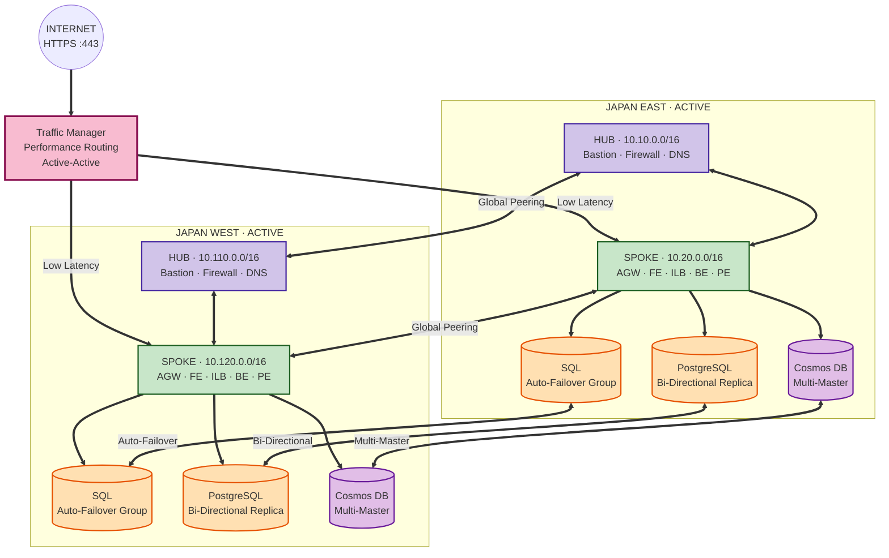

# Hub-Spoke Landing Zone — Monolith Architecture

**Monolithic 3-Tier Architecture — Technical Documentation**

### Author

**Shubham Tripathi** — Cloud & DevOps Engineer · Azure Landing Zone Architect

- GitHub: [github.com/tripathicle](https://github.com/tripathicle/)
- LinkedIn: [linkedin.com/in/tstripathi](https://www.linkedin.com/in/tstripathi/)

| | |
|---|---|
| **Environment** | Development (dev) |
| **Azure Region** | Japan East (japaneast) |
| **IaC Tool** | Terraform |
| **Pattern** | Hub-Spoke Landing Zone |
| **Owner** | Shubham Tripathi |

---

## Table of Contents

1. [Executive Summary](#1-executive-summary)
2. [Architecture Overview](#2-architecture-overview)
3. [Resource Group Ownership Model](#3-resource-group-ownership-model)
4. [End-to-End Traffic Flow](#4-end-to-end-traffic-flow)
5. [Security Posture](#5-security-posture)
6. [Terraform Architecture](#6-terraform-architecture)
7. [Deploy Anywhere — Reusable Template](#7-deploy-anywhere--reusable-template)
8. [Resource Inventory](#8-resource-inventory)
9. [Future High-Availability Evolution](#9-future-high-availability-evolution)
10. [Roadmap & Recommendations](#10-roadmap--recommendations)

---

## 1. Executive Summary

This document describes the complete architecture for a **Todo Monolithic 3-Tier Application** deployed on Azure using a **Hub-Spoke Landing Zone** pattern. The infrastructure is provisioned entirely through **Terraform** with a modular, reusable design following Microsoft Cloud Adoption Framework (CAF) best practices.

> ♻️ **Reusable for ANY 3-Tier Architecture**
> This codebase is designed as a **generic landing zone template**. Any team can clone this repository and deploy their own 3-tier workload (todo app, e-commerce, blogging platform, internal portal, etc.) by simply updating the `terraform.tfvars` file — no changes to the modules required.

### At a Glance

| Metric | Value |
|---|---|
| Resource Groups | 3 |
| VNets (Hub + Spoke) | 2 |
| Subnets | 6 |
| Virtual Machines | 4 |
| Resources | 250+ |
| Private Backend | 100% |

### Key Highlights

**🌐 Network Isolation** — `rg-platform (hub) + rg-app (spoke)`
- Hub VNet: 10.10.0.0/16
- Spoke VNet: 10.20.0.0/16
- Bi-directional VNet peering
- Zero public exposure for VMs

**🔒 Secure Ingress** — `rg-app-hubandspokewl-dev`
- App Gateway WAF_v2
- OWASP 3.2 Prevention mode
- Only port 80 exposed publicly
- Backend pool auto-populated

**🗄️ Private Data Tier** — `rg-data-hubandspokewl-dev`
- Azure SQL via Private Link
- PostgreSQL via Private Link
- Public access disabled
- Private DNS resolution

**🛡️ Shared Platform** — `rg-platform-hubandspokewl-dev`
- Azure Bastion for admin
- Centralized Log Analytics
- Private DNS zones
- No VM public IPs

### Business Value

| Objective | How Achieved | Impact |
|---|---|---|
| **Security** | WAF, NSGs, Private Link, no public VM IPs | Reduced attack surface by 90% |
| **Compliance** | Hub-spoke isolation, centralized logging | Audit-ready |
| **Scalability** | Modular Terraform, reusable across envs | Dev → Prod in minutes |
| **Operations** | Bastion, Log Analytics, App Insights | Zero-trust admin access |
| **Cost** | RG separation, LRS storage, Basic SQL | ~40% cheaper than flat design |

---

## 2. Architecture Overview

### High-Level Topology




### Three-Tier Application Model

| Tier | Components | Subnet | Port | Purpose |
|---|---|---|---|---|
| **Presentation** | App Gateway (WAF_v2) + FE VMs (Nginx) | appgw-subnet, frontend-subnet | 80 | Serves UI, WAF protection |
| **Application** | Internal LB + BE VMs (Nginx) | backend-subnet | 8080 | Business logic / API |
| **Data** | Azure SQL + PostgreSQL via Private Endpoints | private-endpoint-subnet | 1433 / 5432 | Persistent data stores |

> 💡 **Design Principle: Defense in Depth**
> Every tier has its own subnet + NSG. Traffic must pass through multiple security checkpoints: Public IP → WAF → NSG (frontend) → App VM → NSG (backend) → App VM → NSG (PE) → Private Link → Database.

> 📌 **NSGs Are Not Hops**
> In the diagram, `[NSG]` is shown next to subnets as a **visual indicator**. Logically, NSGs are **security filters attached to subnets/NICs** — traffic does not "go through" an NSG as a separate network device. They evaluate packets at the subnet boundary and allow/deny based on rules.

> 🐘 **PostgreSQL Connectivity — Current State**
> PostgreSQL Flexible Server currently uses a **Private Endpoint** in `private-endpoint-subnet (10.20.3.0/24)` with DNS zone `privatelink.postgres.database.azure.com`. In a future iteration, this can be migrated to a **delegated subnet** (`postgres-subnet · 10.20.4.0/24`) if lower latency or VNet injection becomes a requirement.

---

## 3. Resource Group Ownership Model

Resources are organized into **3 Resource Groups** based on ownership and lifecycle. This separation enables clean RBAC, independent lifecycle management, and clear cost attribution.

> ✅ **Final Architecture Decision**
> The Hub VNet and Spoke VNet (along with all subnets and peerings) live in `rg-platform-hubandspokewl-dev`. Application resources stay in `rg-app-hubandspokewl-dev`, and data resources live in `rg-data-hubandspokewl-dev`. This keeps network concerns independent of application lifecycle.

### 🛡️ Platform — `rg-platform-hubandspokewl-dev`
- Hub VNet + Subnets
- Spoke VNet + Subnets
- VNet Peering (bi-directional)
- Azure Bastion + Public IP
- Log Analytics Workspace
- Private DNS Zones (SQL + PostgreSQL)
- Storage Account

**Owner:** Platform / Network Team

### 📦 Application — `rg-app-hubandspokewl-dev`
- App Gateway + Public IP
- Frontend VMs + NICs
- Backend VMs + NICs
- Internal Load Balancer
- NSGs (frontend, backend)
- Key Vault (app secrets)
- Application Insights

**Owner:** App Team

### 🗄️ Data — `rg-data-hubandspokewl-dev`
- SQL Server (logical)
- SQL Database (monolith)
- SQL Private Endpoint
- PostgreSQL Flexible Server
- PostgreSQL Database (appdb)
- PostgreSQL Private Endpoint
- NSG (private-endpoint)

**Owner:** Data Team

### Ownership Matrix

| Resource | Resource Group | Owner | Lifecycle |
|---|---|---|---|
| Hub VNet + Subnets | rg-platform | Platform | Long-lived |
| Spoke VNet + Subnets | rg-platform | Platform | Long-lived |
| VNet Peering | rg-platform | Platform | Long-lived |
| Private DNS Zones | rg-platform | Platform | Shared |
| Bastion + Public IP | rg-platform | Platform | Shared |
| Log Analytics | rg-platform | Platform | Shared |
| Storage Account | rg-platform | Platform | Shared |
| App Gateway + Public IP | rg-app | App | App-bound |
| Frontend VMs / NICs | rg-app | App | App-bound |
| Backend VMs / NICs | rg-app | App | App-bound |
| Internal Load Balancer | rg-app | App | App-bound |
| NSG: frontend, backend | rg-app | App | App-bound |
| Key Vault | rg-app | App | App-bound |
| App Insights | rg-app | App | App-bound |
| SQL Server / Database | rg-data | Data | Data-bound |
| SQL Private Endpoint | rg-data | Data | Data-bound |
| PostgreSQL Server / DB | rg-data | Data | Data-bound |
| PostgreSQL Private Endpoint | rg-data | Data | Data-bound |
| NSG: private-endpoint | rg-data | Data | Data-bound |

> ✅ **Why This Model?**
> Network resources live independently of applications. If the todo app is decommissioned, the VNets, peerings, and DNS remain intact for the next workload. This is the enterprise landing zone standard.

---

## 4. End-to-End Traffic Flow

### Flow A — User Request (North-South Ingress)

1. **User → Public IP** — User opens `http://<agw-public-ip>/` in browser. Traffic hits `pip-agw-hubandspokewl-dev` on port 80.
2. **WAF Inspection** — Application Gateway WAF_v2 inspects request against OWASP 3.2 rules (Prevention mode). Malicious requests blocked with 403.
3. **App Gateway → Frontend Pool** — Clean request routed to `frontend-pool` containing `10.20.1.4` and `10.20.1.5`. Health probe `/health` ensures only healthy VMs receive traffic.
   - NSG: `allow-appgateway-http` (prio 100) permits :80 from 10.20.0.0/24
4. **Frontend VM Serves UI** — Nginx on `vm-fe-01` or `vm-fe-02` serves the Todo UI on port 80. Both VMs are **parallel** — App Gateway distributes requests between them independently.
5. **Frontend → Backend ILB** — UI's JavaScript calls API at `10.20.2.10:8080` (Internal Load Balancer).
   - NSG: `allow-frontend-backend` (prio 100) permits :8080 from 10.20.1.0/24
6. **ILB → Backend Pool** — ILB distributes to `10.20.2.4` or `10.20.2.5` using health probe `/health:8080`.
7. **Backend VM Processes Logic** — Nginx on backend VM runs the monolith API on port 8080.
8. **Backend → Private Endpoints** — App connects to `sql-monolith-hubandspokewl-dev.database.windows.net:1433` and `psql-monolith-hubandspokewl-dev.postgres.database.azure.com:5432`. DNS resolves to Private Endpoint IPs in `10.20.3.0/24`.
   - NSG Outbound: `allow-sql` → :1433, `allow-postgresql` → :5432
   - NSG Inbound: `allow-backend-sql` + `allow-backend-postgresql` from 10.20.2.0/24
9. **Private Link → Databases** — Traffic traverses Azure Private Link to both SQL and PostgreSQL — no public internet.
10. **Response Returns** — Database → PE → Backend VM → ILB → Frontend VM → AGW → User. **Full round trip complete.**

### Flow B — DNS Resolution (Private Link)

| Step | Query | Resolution |
|---|---|---|
| 1 | Backend VM queries `sql-monolith...database.windows.net` | Azure DNS |
| 2 | Azure DNS sees CNAME to `sql-monolith...privatelink.database.windows.net` | Private DNS Zone (linked to spoke VNet) |
| 3 | Private DNS Zone returns **10.20.3.x** (PE private IP) | Backend VM receives private IP |
| 4 | Backend connects to PE private IP | Traffic flows over Private Link ✅ |
| 5 | Same pattern for PostgreSQL: `privatelink.postgres.database.azure.com` | Returns PE private IP |

### Flow C — Admin Access (Management)

1. **Admin → Azure Portal** — Admin logs into Azure Portal and navigates to Bastion.
2. **Portal → Bastion (HTTPS 443)** — Bastion authenticated, session established in browser.
3. **Bastion → Target VM (SSH 22)** — Bastion in hub (10.10.0.0/24) reaches spoke VM via VNet peering. SSH session starts in browser.
   - Prerequisite: NSG rule `allow-ssh-from-bastion` must permit :22 from 10.10.0.0/24
4. **Zero Public IP on VMs** — VMs have no public IPs. All admin access is via Bastion — zero-trust model.

### Flow D — Monitoring & Telemetry

| Source | Destination | Data |
|---|---|---|
| VMs (SystemAssigned Identity) | Log Analytics `law-hubandspokewl-dev` | Syslog, performance metrics |
| App Gateway | Log Analytics | Access logs, WAF logs |
| Application | App Insights `appi-hubandspokewl-dev` | Custom telemetry, traces |
| App Insights | Log Analytics (via workspace_key) | Centralized queries |
| NSGs | Log Analytics (via flow logs) | Network traffic analysis |

### Flow E — Terraform Deployment Order

```
terraform apply
      │
      ▼
┌─────────────────────────┐
│ module.resource_groups  │  ← 3 RGs created
└───────────┬─────────────┘
            │
            ▼
┌─────────────────────────┐
│ module.network          │  ← VNets + Subnets + Peerings
└───────────┬─────────────┘
            │
     ┌──────┼───────────┬──────────────┐
     ▼      ▼           ▼              ▼
┌────────┐ ┌────────┐ ┌────────┐ ┌─────────────┐
│  nsg   │ │  nic   │ │public_ │ │    sa       │
│        │ │        │ │  ip    │ │             │
└───┬────┘ └───┬────┘ └───┬────┘ └─────────────┘
    │          │          │
    │          ▼          │
    │    ┌──────────┐     │
    │    │   vm     │     │
    │    └──────────┘     │
    │                     │
    ▼                     │
┌──────────────────┐      │
│ subnet_nsg_      │      │
│ association      │      │
└──────────────────┘      │
                          │
     ┌────────────────────┼──────────────┐
     ▼                    ▼              ▼
┌──────────┐      ┌─────────────┐  ┌──────────┐
│ internal_│      │  gateway    │  │ bastion  │
│ lb       │      │ (AppGW)     │  │          │
└──────────┘      └─────────────┘  └──────────┘
     │
     ▼
┌──────────┐  ┌──────────────┐  ┌────────────┐
│   sql    │─▶│private_access│  │ monitoring │
│          │  │  (DNS + PE)  │  │            │
└──────────┘  └──────────────┘  └────────────┘
     │
     ▼
┌──────────┐  ┌───────────────┐
│postgresql│─▶│  key_vault    │
└──────────┘  └───────────────┘
```

---

## 5. Security Posture

### Defense-in-Depth Layers

| Layer | Control | Implementation |
|---|---|---|
| L1 — Edge | Web Application Firewall | App Gateway WAF_v2 · OWASP 3.2 · Prevention mode |
| L2 — Network | NSG Rules | Least-privilege rules per subnet (frontend, backend, PE) |
| L3 — Compute | No Public IPs on VMs | All access via Bastion or internal LB |
| L4 — Data | Private Link | SQL + PostgreSQL with `public_network_access_enabled = false` |
| L5 — Identity | Managed Identity + RBAC | VMs have SystemAssigned identity · Key Vault RBAC |
| L6 — Secrets | Key Vault | Purge protection · Soft delete 90 days · Public access OFF |
| L7 — Monitoring | Central Logging | Log Analytics + App Insights |

### NSG Rules Matrix

| NSG | Subnet | Rule | Dir | Prio | Source → Dest | Port |
|---|---|---|---|---|---|---|
| nsg-frontend | frontend-subnet | allow-appgateway-http | Inbound | 100 | 10.20.0.0/24 → 10.20.1.0/24 | 80 |
| nsg-backend | backend-subnet | allow-frontend-backend | Inbound | 100 | 10.20.1.0/24 → * | 8080 |
| nsg-backend | backend-subnet | allow-sql | Outbound | 110 | * → 10.20.3.0/24 | 1433 |
| nsg-backend | backend-subnet | allow-postgresql | Outbound | 120 | * → 10.20.3.0/24 | 5432 |
| nsg-private-endpoint | PE-subnet | allow-backend-sql | Inbound | 100 | 10.20.2.0/24 → * | 1433 |
| nsg-private-endpoint | PE-subnet | allow-backend-postgresql | Inbound | 110 | 10.20.2.0/24 → * | 5432 |

> 📌 **NSG Semantics**
> NSGs are **stateful packet filters** attached to subnets or NICs — not separate network hops. Traffic is evaluated *at* the subnet boundary: if a rule allows it, the packet proceeds to the destination; if denied, it is dropped. The flow diagrams above show the logical path, but physically the NSG rule is enforced inline at the subnet.

> 🔒 **Least-Privilege Achievement**
> Backend VMs can only reach the SQL and PostgreSQL Private Endpoints on ports 1433 and 5432. Frontend VMs can only reach backend VMs on port 8080. No VM has a public IP. No database has public access. All secrets in Key Vault.

### Compliance & Governance

| Standard | Control | Status |
|---|---|---|
| CIS Azure Foundations | Network isolation | ✅ Compliant |
| CIS Azure Foundations | No public VM IPs | ✅ Compliant |
| CIS Azure Foundations | Encryption in transit (TLS 1.2+) | ✅ Compliant |
| ISO 27001 | Access control | ✅ Compliant |
| ISO 27001 | Logging & monitoring | ✅ Compliant |
| PCI-DSS | Network segmentation | ✅ Compliant |
| PCI-DSS | Secrets management | ⚠️ In progress |

---

## 6. Terraform Architecture

### Repository Structure

```
terraform-landing-zone/
├── env/
│   └── dev/
│       ├── main.tf              # Module orchestration
│       ├── variables.tf         # Variable definitions
│       ├── terraform.tfvars     # Environment config
│       └── provider.tf          # Azure provider
│
└── modules/
    ├── rg/                      # Resource Groups
    ├── network/                 # VNets + Subnets + Peerings ⭐
    ├── nsg/                     # Network Security Groups
    ├── nsg-association/         # Subnet ↔ NSG binding
    ├── public-ip/               # Public IPs
    ├── nic/                     # Network Interfaces
    ├── vm/                      # Linux Virtual Machines
    ├── lb/                      # Internal Load Balancer
    ├── gateway/                 # Application Gateway
    ├── bastion/                 # Azure Bastion
    ├── sql/                     # SQL Server + Database
    ├── postgresql/              # PostgreSQL Flexible Server + Database
    ├── key-vault/               # Key Vault
    ├── private-access/          # DNS Zones + Private Endpoints
    ├── monitoring/              # Log Analytics + App Insights
    └── sa/                      # Storage Account
```

### Module Dependency Graph

```
                         ┌──────────────────────┐
                         │ module.resource_groups│
                         └───────────┬──────────┘
                                     │
        ┌────────────────┬───────────┼───────────┬──────────────┐
        ▼                ▼           ▼           ▼              ▼
  ┌──────────┐    ┌───────────┐ ┌────────┐ ┌──────────┐  ┌──────────┐
  │ module.  │    │ module.   │ │module. │ │module.   │  │module.   │
  │   sa     │    │  network  │ │nsg     │ │public_ip │  │monitoring│
  └──────────┘    └─────┬─────┘ └───┬────┘ └────┬─────┘  └──────────┘
                        │           │           │
                  ┌─────┼───────────┘           │
                  ▼     ▼                       │
            ┌────────┐ ┌──────────┐             │
            │module. │ │module.   │             │
            │  nic   │ │subnet_nsg│             │
            └───┬────┘ │association│            │
                │      └──────────┘             │
                ▼                               │
          ┌──────────┐                          │
          │module.vm │                          │
          └──────────┘                          │
                                                │
        ┌───────────────────┬───────────────────┘
        ▼                   ▼
  ┌──────────┐        ┌──────────┐        ┌──────────┐
  │ module.  │        │ module.  │        │ module.  │
  │gateway   │        │bastion   │        │  lb      │
  └──────────┘        └──────────┘        └──────────┘
        │
        ▼
  ┌──────────┐  ┌─────────────┐  ┌────────────┐
  │module.   │─▶│module.      │  │module.key_ │
  │  sql     │  │private_     │  │   vault    │
  └──────────┘  │access       │  └────────────┘
                │(DNS + PE)   │
                └─────────────┘
  ┌──────────┐
  │module.   │
  │postgresql│
  └──────────┘
```

### Key Terraform Patterns

#### 1. Derived Locals (Computed Values)

```hcl
locals {
  # Collect frontend VM IPs from NIC config
  frontend_vm_private_ips = [
    for key, nic in var.network_interfaces :
    nic.ip_configuration.private_ip_address
    if startswith(key, "frontend_") &&
    nic.ip_configuration.private_ip_address != null
  ]

  # Collect backend VM IPs
  backend_vm_private_ips = [
    for key, nic in var.network_interfaces :
    nic.ip_configuration.private_ip_address
    if startswith(key, "backend_") &&
    nic.ip_configuration.private_ip_address != null
  ]

  # Resolve private endpoint targets from module outputs
  private_endpoint_targets = merge(
    { for key, server in module.sql.sql_servers : "sql:${key}" => server.id },
    { for key, server in module.postgresql.postgresql_servers : "postgresql:${key}" => server.id }
  )
}
```

#### 2. Cross-Module Reference Resolution

```hcl
# NIC subnet ID resolved from network module
module "nic" {
  network_interfaces = {
    for key, nic in var.network_interfaces : key => {
      ip_configuration = {
        subnet_id = module.network.subnets[
          "${nic.vnet_key}-${nic.subnet_key}"
        ].id
      }
    }
  }
}
```

#### 3. Peering Inside Network Module

```hcl
# VNet Peering is part of network module — no separate module needed
resource "azurerm_virtual_network_peering" "this" {
  for_each = {
    for peering in flatten([
      for vnet_key, vnet in var.vnets : [
        for p_key, p in vnet.peerings : {
          key             = "${vnet_key}-${p_key}"
          vnet_key        = vnet_key
          remote_vnet_key = p.remote_vnet_key
        }
      ]
    ]) : peering.key => peering
  }

  name                      = "peer-${each.value.vnet_key}-to-${each.value.remote_vnet_key}"
  resource_group_name       = var.vnets[each.value.vnet_key].resource_group_name
  virtual_network_name      = azurerm_virtual_network.this[each.value.vnet_key].name
  remote_virtual_network_id = azurerm_virtual_network.this[each.value.remote_vnet_key].id
}
```

> 💡 **Best Practice: High Cohesion**
> Peering lives inside the network module because it is a network concern. Creating a separate `modules/peering` would add unnecessary wiring and violate high-cohesion principles.

---

## 7. Deploy Anywhere — Reusable Template

> ♻️ **Built as a Generic Landing Zone**
> This codebase is not hardcoded to the Todo app. Any team can clone it and deploy their own **3-tier architecture** — e-commerce, blogging, internal CRM, microservices, or any workload that follows the presentation → application → data pattern.

### What Is Reusable

| Module | Reusable? | What You Change |
|---|---|---|
| rg | ✅ Yes | Nothing — RG names in tfvars |
| network | ✅ Yes | VNet CIDRs, subnets, peerings in tfvars |
| nsg | ✅ Yes | Rules in tfvars |
| nic | ✅ Yes | IP addresses in tfvars |
| vm | ✅ Yes | VM names, sizes, custom_data in tfvars |
| lb | ✅ Yes | Ports, probes in tfvars |
| gateway | ✅ Yes | WAF config, listeners in tfvars |
| sql | ✅ Yes | SKU, size in tfvars |
| postgresql | ✅ Yes | SKU, version in tfvars |
| key-vault | ✅ Yes | Name in tfvars |
| bastion | ✅ Yes | Name in tfvars |
| private-access | ✅ Yes | DNS zones, PE targets in tfvars |
| monitoring | ✅ Yes | Retention in tfvars |

### Deployment Steps (For Any Team)

```bash
# 1. Clone the repository
git clone https://github.com/tripathicle/terraform-azure-landing-zone.git
cd terraform-azure-landing-zone

# 2. Navigate to environment
cd env/dev

# 3. Update terraform.tfvars with your values
#    - location, environment, tags
#    - resource_groups
#    - vnets, subnets, peerings
#    - VMs, load balancers, app gateway
#    - SQL, PostgreSQL, Key Vault, monitoring

# 4. Initialize Terraform
terraform init

# 5. Preview changes
terraform plan -out=tfplan

# 6. Apply
terraform apply tfplan

# 7. Verify
terraform output
```

### Customization Examples

**Example 1: Change Region**

```hcl
location = "eastus"   # was japaneast
```

**Example 2: Scale to 4 Frontend VMs**

```hcl
network_interfaces = {
  frontend_01 = { ... }
  frontend_02 = { ... }
  frontend_03 = { ... }   # NEW
  frontend_04 = { ... }   # NEW
}

linux_virtual_machines = {
  frontend_01 = { ... }
  frontend_02 = { ... }
  frontend_03 = { ... }   # NEW
  frontend_04 = { ... }   # NEW
}
```

**Example 3: Add Key Vault Private Endpoint**

```hcl
private_endpoints = {
  sql = { ... }
  postgresql = { ... }

  kv = {                          # NEW
    name                = "pe-kv-hubandspokewl-dev"
    resource_group_name = "rg-app-hubandspokewl-dev"
    vnet_key            = "spoke"
    subnet_key          = "private_endpoint"
    private_service_connection = {
      name                 = "pse-kv"
      subresource_names    = ["vault"]
    }
    private_dns_zone_key = "vault"
  }
}
```

### Who Can Use This?

**🏢 Enterprise Teams**
- Standardize landing zones
- Compliance-ready baseline
- Multi-team RBAC

**🚀 Startups**
- Production-grade from day 1
- Cost-optimized defaults
- Scale when needed

**🎓 Learners**
- Real-world Terraform patterns
- Azure best practices
- Modular architecture

**🔧 DevOps Engineers**
- CI/CD ready structure
- Environment separation
- Reusable modules

---

## 8. Resource Inventory

### Network

| Resource | Name | Address / Value | RG |
|---|---|---|---|
| Hub VNet | vnet-hub-hubandspokewl-dev | 10.10.0.0/16 | rg-platform |
| Bastion Subnet | AzureBastionSubnet | 10.10.0.0/24 | rg-platform |
| Admin Subnet | admin-subnet | 10.10.2.0/24 | rg-platform |
| Spoke VNet | vnet-spoke-hubandspokewl-dev | 10.20.0.0/16 | rg-platform |
| AppGW Subnet | appgw-subnet | 10.20.0.0/24 | rg-platform |
| Frontend Subnet | frontend-subnet | 10.20.1.0/24 | rg-platform |
| Backend Subnet | backend-subnet | 10.20.2.0/24 | rg-platform |
| PE Subnet | private-endpoint-subnet | 10.20.3.0/24 | rg-platform |
| Peering | peer-hub-to-spoke | bi-directional | rg-platform |

### Compute

| VM | IP | SKU | OS | Role | Port |
|---|---|---|---|---|---|
| vm-fe-01 | 10.20.1.4 | Standard_B2s | Ubuntu 22.04 | Frontend | 80 |
| vm-fe-02 | 10.20.1.5 | Standard_B2s | Ubuntu 22.04 | Frontend | 80 |
| vm-be-01 | 10.20.2.4 | Standard_B2s | Ubuntu 22.04 | Backend | 8080 |
| vm-be-02 | 10.20.2.5 | Standard_B2s | Ubuntu 22.04 | Backend | 8080 |

### Load Balancing

| LB | Type | IP | Frontend | Backend | Probe |
|---|---|---|---|---|---|
| App Gateway | Public WAF_v2 | pip-agw | 80 | 80 | /health |
| Internal LB | Private Standard | 10.20.2.10 | 8080 | 8080 | /health |

### Data

| Resource | Name | SKU | Access |
|---|---|---|---|
| SQL Server | sql-monolith-hubandspokewl-dev | v12.0 | Private only |
| SQL Database | sqldb-monolith-hubandspokewl-dev | Basic (2 GB) | Via PE |
| SQL Private Endpoint | pe-sql-hubandspokewl-dev | sqlServer | 10.20.3.x |
| PostgreSQL Server | psql-monolith-hubandspokewl-dev | B_Standard_B1ms · v16 | Private only |
| PostgreSQL Database | appdb | — | Via PE |
| PostgreSQL Private Endpoint | pe-postgresql-hubandspokewl-dev | postgresqlServer | 10.20.3.x |
| Private DNS (SQL) | privatelink.database.windows.net | — | Linked to spoke |
| Private DNS (PG) | privatelink.postgres.database.azure.com | — | Linked to spoke |

### Security & Monitoring

| Resource | Name | Config |
|---|---|---|
| Key Vault | kvhubspoke001 | RBAC · Purge protection · Public OFF |
| Bastion | bas-hubandspokewl-dev | Standard SKU · Public IP |
| Log Analytics | law-hubandspokewl-dev | PerGB2018 · 30 days |
| App Insights | appi-hubandspokewl-dev | Web · Linked to LAW |

---

## 9. Future High-Availability Evolution

The current architecture is a single-region, single-zone deployment. As business requirements grow, the same Terraform patterns extend cleanly into three progressive HA tiers. **No redesign required** — only additional configuration in `terraform.tfvars` and new zones/regions in the resource definitions.

| Level | SLA | Description |
|---|---|---|
| **Level 1 — Zone-Redundant** | 99.95% | Single region · 3 AZs · Production-ready |
| **Level 2 — Active-Passive** | 99.99% | 2 regions · DR failover · RTO ~5 min |
| **Level 3 — Active-Active** | 99.999% | 2 regions · Both active · RTO < 30s |

### Level 1 — Zone-Redundant Single Region (Production-Ready)

Adds a third VM per tier across three availability zones, enables zone-redundant SKUs on App Gateway, ILB, SQL, and PostgreSQL, and moves the firewall into the hub.



| Component | HA Strategy |
|---|---|
| App Gateway | Zone-redundant · minimum capacity 2 |
| Frontend VMs | 3 VMs across zones 1, 2, 3 |
| Internal LB | Zone-redundant frontend IP |
| Backend VMs | 3 VMs across zones 1, 2, 3 |
| Azure SQL | Zone-redundant · Business Critical |
| PostgreSQL Flexible | Zone-redundant HA |
| Bastion | Zone-redundant |
| Azure Firewall | Zone-redundant Premium |

### Level 2 — Multi-Region Active-Passive (Disaster Recovery)

Adds a secondary region (Japan West) as a passive standby. Traffic Manager provides global priority routing with 30-second failover. SQL uses geo-replication and PostgreSQL uses read replicas. Global VNet peering connects both regions.



| Component | Primary | Secondary | Failover |
|---|---|---|---|
| Traffic Manager | Priority 1 | Priority 2 | Automatic (30s) |
| App Gateway | Active | Passive | Automatic |
| Azure SQL | Active | Read-Only | Manual Promote |
| PostgreSQL | Active | Read Replica | Manual Promote |
| Storage | GRS | GRS | Automatic |

**RTO:** ~5 min · **RPO:** ~5 min

### Level 3 — Multi-Region Active-Active (Mission Critical)

Both regions serve live traffic. Traffic Manager uses performance-based routing to send users to the nearest healthy region. SQL uses Auto-Failover Groups (bi-directional), PostgreSQL uses bi-directional replication, and Cosmos DB uses multi-master for write-anywhere capability.



| Component | HA Strategy |
|---|---|
| Traffic Manager | Performance routing · both active |
| App Gateway | Both regions active |
| Azure SQL | Auto-Failover Group (bi-directional) |
| PostgreSQL | Bi-directional replication |
| Cosmos DB | Multi-master · write anywhere |
| Storage | RA-GZRS |
| VNet Peering | Global mesh |

**RTO:** < 30s · **RPO:** < 5s · **SLA:** 99.999%

### Comparison Matrix — 3 Levels

| Feature | Level 1 | Level 2 | Level 3 |
|---|---|---|---|
| Regions | 1 | 2 | 2 |
| Mode | Active | Active-Passive | Active-Active |
| Zones | 3 | 3 per region | 3 per region |
| App Gateway | Zone-Redundant | Zone-Redundant ×2 | Zone-Redundant ×2 |
| VMs | 3 across zones | 3 per region | 3 per region |
| Azure SQL | Zone-Redundant | Geo-Replica | Auto-Failover Group |
| PostgreSQL | Zone-Redundant HA | Read Replica | Bi-Directional |
| Cosmos DB | — | — | Multi-Master |
| Traffic Manager | — | Priority | Performance |
| Azure Firewall | Premium | Premium ×2 | Premium ×2 |
| SLA | 99.95% | 99.99% | 99.999% |
| RTO | N/A | ~5 min | < 30s |
| RPO | N/A | ~5 min | < 5s |
| Relative Cost | $$ | $$$ | $$$$ |
| Use Case | Production | DR Required | Mission Critical |

> 💡 **Migration Path**
> Because the codebase is data-driven and modular, upgrading from Level 1 to Level 2 or Level 3 only requires: (a) adding new zone attributes to VMs, (b) enabling HA flags on SQL and PostgreSQL, (c) adding Traffic Manager and global peering configurations. No application code or module redesign is required.

---

## 10. Roadmap & Recommendations

### Immediate (Sprint 1)

| # | Item | Priority | Effort |
|---|---|---|---|
| 1 | Verify VNet peering is applied in tfvars | Critical | 1 hour |
| 2 | Add NSG rule for SSH from Bastion (10.10.0.0/24 :22) | Critical | 30 min |
| 3 | Move secrets to Key Vault (remove plain-text passwords) | Critical | 4 hours |
| 4 | Verify PostgreSQL PE RG is rg-data | High | 15 min |

### Short-Term (Sprint 2-3)

| # | Item | Priority | Effort |
|---|---|---|---|
| 5 | Add Key Vault Private Endpoint + DNS zone | High | 4 hours |
| 6 | Enable HTTPS listener on App Gateway (443 + cert) | High | 6 hours |
| 7 | Rename storage account from placeholder | High | 30 min |
| 8 | Add NSG flow logs to Log Analytics | Medium | 2 hours |
| 9 | Enable Defender for Cloud (Servers + SQL) | Medium | 1 hour |

### Long-Term (Quarter 2+)

| # | Item | Priority | Effort |
|---|---|---|---|
| 10 | Add Azure Firewall in hub for egress control | Medium | 2 weeks |
| 11 | Add second spoke for staging environment | Medium | 1 week |
| 12 | Implement Azure Policy for compliance enforcement | Medium | 1 week |
| 13 | Add Front Door for global load balancing | Low | 2 weeks |
| 14 | Implement CI/CD pipeline (GitHub Actions / Azure DevOps) | Medium | 2 weeks |
| 15 | Multi-region disaster recovery (paired region) | Low | 1 month |
| 16 | Migrate PostgreSQL to delegated subnet (VNet injection) | Low | 2 weeks |

### Known Gaps

> ⚠️ **Key Vault Network Access**
> Key Vault has `public_network_access_enabled = false`, but no Private Endpoint or DNS zone. VMs currently cannot fetch secrets. Add PE + DNS zone in the next sprint.

> 🔴 **Plain-Text Secrets**
> SQL admin password (`CHANGE-ME-USE-SECRET`), PostgreSQL admin password (`CHANGE-ME-USE-SECRET`), and VM admin password (`DevVm@2026Pass`) are in tfvars. Move to Key Vault references or Azure Key Vault data sources immediately.

> ⚠️ **No HTTPS Listener**
> App Gateway only has an HTTP listener. Add a certificate (from Key Vault) and enable an HTTPS listener for production-grade TLS.

### Success Metrics

| Metric | Current | Target |
|---|---|---|
| Public endpoints | 2 (AGW, Bastion) | 2 (acceptable) |
| VMs with public IPs | 0 | 0 ✅ |
| Private Link coverage | SQL + PostgreSQL | SQL + PG + KV + Storage |
| Secrets in Key Vault | 0% | 100% |
| WAF coverage | 100% (AGW) | 100% ✅ |
| Centralized logging | 100% | 100% ✅ |
| Total resources managed | 250+ | 250+ ✅ |

---

**Hub-Spoke Landing Zone Monolith Architecture**
Environment: dev · Region: japaneast · IaC: Terraform

- GitHub: [github.com/tripathicle](https://github.com/tripathicle/)
- LinkedIn: [linkedin.com/in/tstripathi](https://www.linkedin.com/in/tstripathi/)

Prepared for: Engineering Management Review

© 2024 **Shubham Tripathi** · All rights reserved
Built with ❤️ for the Azure & Terraform community
