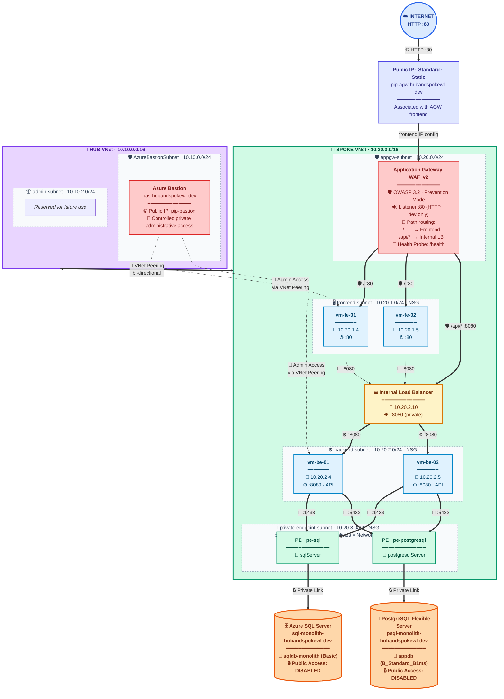
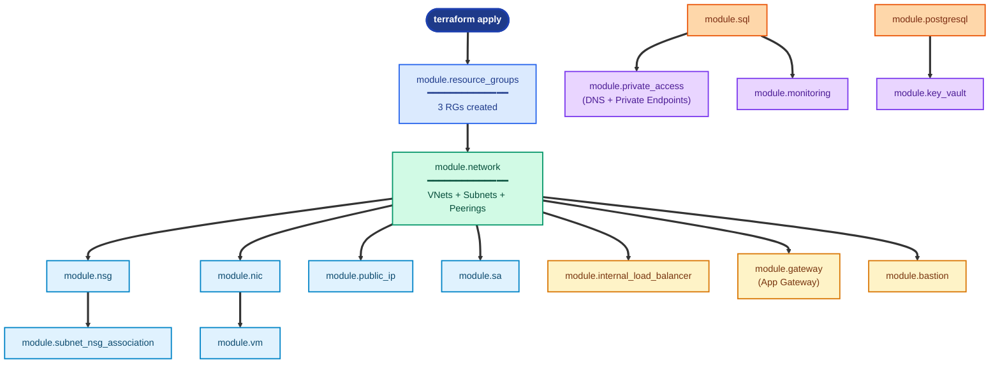
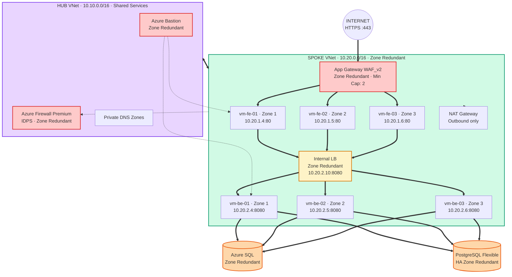
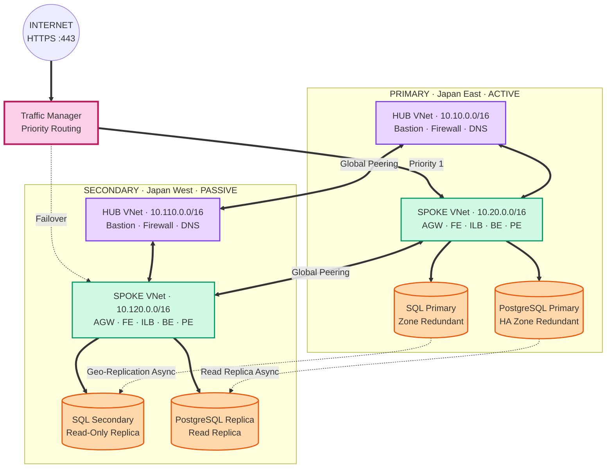
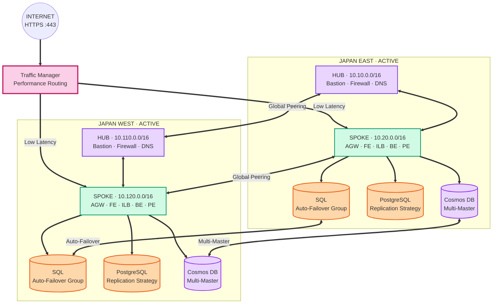

# Hub-Spoke Landing Zone

**A Terraform-based Azure Hub-Spoke Workload Landing Zone for a monolithic 3-tier application, deployed as a development foundation with private workload compute, WAF-protected ingress, private database connectivity, centralized monitoring, and Bastion-based administration.**

**Author:** Shubham Tripathi — Cloud & DevOps Engineer · Azure Landing Zone Architect
[GitHub: github.com/tripathicle](https://github.com/tripathicle/) · [LinkedIn: linkedin.com/in/tstripathi](https://www.linkedin.com/in/tstripathi/)

| | |
|---|---|
| **Environment** | Development (dev) |
| **Azure Region** | Japan East (`japaneast`) |
| **IaC Tool** | Terraform |
| **Pattern** | Hub-Spoke Landing Zone |
| **Owner** | Shubham Tripathi |

---

## Table of Contents

1. [Executive Summary](#1-executive-summary)
2. [Architecture Overview](#2-architecture-overview)
3. [Resource Group Ownership Model](#3-resource-group-ownership-model)
4. [End-to-End Traffic Flow](#4-end-to-end-traffic-flow)
5. [Security Posture](#5-security-posture)
6. [Terraform Architecture](#6-terraform-architecture)
7. [CI/CD & Security Validation Pipeline](#7-cicd--security-validation-pipeline)
8. [Deploy Anywhere — Reusable Template](#8-deploy-anywhere--reusable-template)
9. [Resource Inventory](#9-resource-inventory)
10. [Future High-Availability Reference Designs](#10-future-high-availability-reference-designs)
11. [Roadmap & Current Status](#11-roadmap--current-status)

---

## 1. Executive Summary

This document describes the architecture for a **Todo Monolithic 3-Tier Application** deployed on Azure using a **Hub-Spoke Landing Zone** pattern. The infrastructure is provisioned entirely through **Terraform** with a modular, reusable design aligned to Microsoft Cloud Adoption Framework (CAF) guidance.

> ♻️ **Reusable for Any 3-Tier Architecture**
> This codebase is designed as a **generic landing zone template**. Any team can clone this repository and deploy their own 3-tier workload (todo app, e-commerce, blogging platform, internal portal, etc.) by updating the `terraform.tfvars` file — no changes to the modules are required.

### At a Glance

| Metric | Value |
|---|---|
| Resource Groups | 3 |
| VNets (Hub + Spoke) | 2 |
| Subnets | 6 |
| Virtual Machines | 4 |
| Terraform Modules | 16 |
| Private Backend | 100% |

### Key Highlights

**🌐 Network Isolation** — `rg-platform + rg-app`
- Hub VNet: 10.10.0.0/16
- Spoke VNet: 10.20.0.0/16
- Bi-directional VNet peering
- Zero public IP on workload VMs

**🔒 Secure Ingress** — `rg-app-hubandspokewl-dev`
- App Gateway WAF_v2
- OWASP 3.2 Prevention mode
- HTTP :80 in dev (HTTPS pending)
- Backend pool auto-populated from NIC

**🗄️ Private Data Tier** — `rg-data-hubandspokewl-dev`
- Azure SQL via Private Link
- PostgreSQL Flexible via Private Link
- Public network access disabled
- Private DNS resolution

**🛡️ Shared Platform** — `rg-platform-hubandspokewl-dev`
- Azure Bastion for admin
- Centralized Log Analytics
- Private DNS zones
- No VM public IPs

### Business Value

| Objective | How Achieved | Outcome |
|---|---|---|
| **Security** | WAF, NSG segmentation, Private Link, no public VM IPs | ✅ Eliminated public exposure of workload VMs and databases |
| **Governance** | Hub-spoke isolation, RG separation, centralized logging | ✅ Clear ownership and lifecycle boundaries |
| **Scalability** | Modular Terraform, data-driven configuration | ✅ Same modules reusable across environments |
| **Operations** | Bastion, Log Analytics, App Insights | ✅ Private administrative access without VM public IPs |
| **Cost Control** | RG separation, right-sized dev SKUs | ✅ Independent lifecycle and cost attribution |

---

## 2. Architecture Overview

### High-Level Topology


### Three-Tier Application Model

| Tier | Components | Subnet | Port | Purpose |
|---|---|---|---|---|
| **Presentation** | App Gateway (WAF_v2) + FE VMs (Nginx) | appgw-subnet, frontend-subnet | 80 | Serves UI, WAF protection |
| **Application** | Internal LB + BE VMs (Nginx) | backend-subnet | 8080 | Business logic / API |
| **Data** | Azure SQL + PostgreSQL via Private Endpoints | private-endpoint-subnet | 1433 / 5432 | Persistent data stores |

### Subnet Layout

| Tier | Subnet | CIDR | Notes |
|---|---|---|---|
| Azure Bastion | AzureBastionSubnet | 10.10.0.0/24 | Hub · dedicated |
| Hub Admin | admin-subnet | 10.10.2.0/24 | Hub · reserved |
| Application Gateway | appgw-subnet | 10.20.0.0/24 | Spoke · ingress |
| Frontend | frontend-subnet | 10.20.1.0/24 | Spoke · NSG attached |
| Backend | backend-subnet | 10.20.2.0/24 | Spoke · NSG attached |
| Private Endpoints | private-endpoint-subnet | 10.20.3.0/24 | Spoke · NSG attached, `private_endpoint_network_policies = "NetworkSecurityGroupEnabled"` |

> 💡 **Design Principle: Defense in Depth**
> Each tier has its own subnet and NSG. Traffic passes through multiple checkpoints: Public IP → WAF → NSG (frontend) → VM → NSG (backend) → VM → NSG (PE) → Private Link → database.

> 📌 **NSGs Are Not Hops**
> In diagrams, `[NSG]` is shown next to subnets as a visual indicator. NSGs are **stateful packet filters attached to subnets or NICs** — traffic does not "go through" an NSG as a separate device. Rules are evaluated inline at the subnet boundary.

> 🐘 **PostgreSQL Connectivity — Current State**
> PostgreSQL Flexible Server currently uses a **Private Endpoint** in `private-endpoint-subnet (10.20.3.0/24)` with DNS zone `privatelink.postgres.database.azure.com`. Both Private Endpoint and VNet-integrated (delegated subnet) are valid Azure networking models; the choice is a deployment-model decision, not simply a latency optimization. Migrating to VNet integration later would require a deliberate subnet and DNS architecture change.

---

## 3. Resource Group Ownership Model

Resources are organized into **3 Resource Groups** based on ownership and lifecycle. This separation enables clean RBAC, independent lifecycle management, and clear cost attribution.

### 🛡️ Platform — `rg-platform-hubandspokewl-dev`
- Hub VNet + Subnets
- Spoke VNet + Subnets
- VNet Peering (bi-directional)
- Azure Bastion + Public IP
- Log Analytics Workspace
- Private DNS Zones (SQL + PostgreSQL)
- Storage Account

**Owner:** Platform / Network Team

### 📦 Application — `rg-app-hubandspokewl-dev`
- App Gateway + Public IP
- Frontend VMs + NICs
- Backend VMs + NICs
- Internal Load Balancer
- NSGs (frontend, backend)
- Key Vault (secret management foundation)
- Application Insights

**Owner:** App Team

### 🗄️ Data — `rg-data-hubandspokewl-dev`
- SQL Server (logical)
- SQL Database (monolith)
- SQL Private Endpoint
- PostgreSQL Flexible Server
- PostgreSQL Database (appdb)
- PostgreSQL Private Endpoint
- NSG (private-endpoint)

**Owner:** Data Team

### Ownership Matrix

| Resource | Resource Group | Owner | Lifecycle |
|---|---|---|---|
| Hub VNet + Subnets | rg-platform | Platform | Long-lived |
| Spoke VNet + Subnets | rg-platform | Platform | Long-lived |
| VNet Peering | rg-platform | Platform | Long-lived |
| Private DNS Zones | rg-platform | Platform | Shared |
| Bastion + Public IP | rg-platform | Platform | Shared |
| Log Analytics | rg-platform | Platform | Shared |
| Storage Account | rg-platform | Platform | Shared |
| App Gateway + Public IP | rg-app | App | App-bound |
| Frontend VMs / NICs | rg-app | App | App-bound |
| Backend VMs / NICs | rg-app | App | App-bound |
| Internal Load Balancer | rg-app | App | App-bound |
| NSG: frontend, backend | rg-app | App | App-bound |
| Key Vault | rg-app | App | App-bound |
| App Insights | rg-app | App | App-bound |
| SQL Server / Database | rg-data | Data | Data-bound |
| SQL Private Endpoint | rg-data | Data | Data-bound |
| PostgreSQL Server / DB | rg-data | Data | Data-bound |
| PostgreSQL Private Endpoint | rg-data | Data | Data-bound |
| NSG: private-endpoint | rg-data | Data | Data-bound |

> ✅ **Why This Model?**
> Network resources live independently of applications. If the workload is decommissioned, the VNets, peerings, and DNS remain intact for the next workload. This ownership model provides clear RBAC, lifecycle, and cost boundaries and is commonly used as an enterprise landing-zone pattern — although real organizations may design their resource-group boundaries differently based on their own governance and operational requirements.

---

## 4. End-to-End Traffic Flow

### Flow A — User Request (North-South Ingress)

1. **User → Public IP** — User opens `http://<agw-public-ip>/` in browser. Traffic hits `pip-agw-hubandspokewl-dev` on port 80. The Public IP is associated with the Application Gateway's **frontend IP configuration** — it is not a standalone resource inside the subnet.
2. **WAF Inspection** — Application Gateway WAF_v2 inspects the request against OWASP 3.2 rules (Prevention mode). Malicious requests are blocked with HTTP 403.
3. **Path-Based Routing** — Clean requests are routed based on URL path:
   - `/` → Frontend VM pool (`10.20.1.4`, `10.20.1.5`) on port 80
   - `/api/*` → Internal Load Balancer (`10.20.2.10`) on port 8080
   - NSG: `allow-appgateway-http` (prio 100) permits :80 from 10.20.0.0/24 to frontend
4. **Frontend VM Serves UI** — Nginx on `vm-fe-01` or `vm-fe-02` serves the UI on port 80. **Both frontend VMs are parallel** — App Gateway distributes requests between them independently.
5. **Frontend Application Calls Backend API** — The frontend application (or App Gateway directly, via `/api/*`) sends API requests to the Internal Load Balancer at `10.20.2.10:8080`. The ILB is private and never exposed to the internet.
   - NSG (frontend path): `allow-frontend-backend` (prio 100) permits :8080 from 10.20.1.0/24
   - NSG (App Gateway path): `allow-appgateway-backend` (prio 105) permits :8080 from 10.20.0.0/24
6. **ILB → Backend Pool** — ILB distributes to `10.20.2.4` or `10.20.2.5` using health probe `/health:8080`. Azure Load Balancer health probe traffic is permitted on port 8080 (priority 110).
7. **Backend VM Processes Logic** — Nginx on the backend VM runs the monolithic API on port 8080.
8. **Backend → Private Endpoints** — App connects to the database FQDNs:
   - `sql-monolith-hubandspokewl-dev.database.windows.net:1433`
   - `psql-monolith-hubandspokewl-dev.postgres.database.azure.com:5432`

   Applications resolve these FQDNs via Private DNS — never hardcode the PE IP.
   - NSG Outbound: `allow-sql` (prio 120) → :1433, `allow-postgresql` (prio 130) → :5432
   - NSG Inbound (PE): `allow-backend-sql` (prio 100) and `allow-backend-postgresql` (prio 110) from 10.20.2.0/24
9. **Private Link → Databases** — Traffic traverses Azure Private Link to Azure SQL and PostgreSQL — no public internet exposure.
10. **Response Returns** — Database → PE → Backend VM → ILB → (frontend or App Gateway) → User. Full round trip complete.

### Flow B — DNS Resolution (Private Link)

| Step | Action | Resolution |
|---|---|---|
| 1 | Application uses the database FQDN (not a hardcoded PE IP) | Client-side |
| 2 | Azure DNS returns CNAME to `<name>.privatelink.<service>.…` | Azure DNS |
| 3 | Private DNS zone (linked to spoke VNet) resolves to the Private Endpoint IP | Private DNS |
| 4 | Application opens a TCP connection to the Private Endpoint IP | Private networking |
| 5 | Traffic flows over Azure Private Link to the database | Azure backbone |

> 💡 **Always Use FQDN**
> Applications should resolve the database by FQDN, not by hardcoded PE IP. This keeps DNS-based routing intact when additional workloads (e.g., Agricart, SMS, Axion) are added later.

### Flow C — Admin Access (Management)

1. **Admin → Azure Portal** — Admin logs into the Azure Portal and navigates to Azure Bastion.
2. **Portal → Bastion (HTTPS 443)** — Bastion authenticates the admin, and an in-browser session is established.
3. **Bastion → Target VM** — Bastion in the hub (10.10.0.0/24) reaches the target spoke VM via VNet peering. SSH session opens in the browser.
   - ⚠️ **Status:** Bastion-to-VM SSH NSG rule is **pending verification/addition**. The frontend and backend NSGs currently do not have an explicit SSH :22 allow rule from the Bastion subnet. If an NSG is attached to `AzureBastionSubnet` in the future, Azure requires a specific set of platform and data-plane rules (including 443, GatewayManager 443, 8080/5701, AzureLoadBalancer 443, outbound 22/3389, AzureCloud 443, and Internet 80).
4. **Zero Public IP on VMs** — Workload VMs have no public IPs. All administrative access is via Bastion — private administrative access without exposing VM public IPs.

### Flow D — Monitoring & Telemetry

| Source | Destination | Data |
|---|---|---|
| VMs (SystemAssigned Identity) | Log Analytics `law-hubandspokewl-dev` | Syslog, performance metrics |
| App Gateway | Log Analytics | Access logs, WAF logs |
| Application | App Insights `appi-hubandspokewl-dev` | Custom telemetry, traces |
| App Insights | Log Analytics (via workspace_key) | Centralized queries |
| NSGs | Log Analytics (flow logs — planned) | Network traffic analysis |

### Flow E — Terraform Dependency Flow

> 💡 **Diagram Is Not Strict Execution Order**
> Terraform does not execute resources strictly top-to-bottom. It builds a dependency graph and creates resources based on their references. The diagram below shows the conceptual dependency flow between modules.



---

## 5. Security Posture

### Defense-in-Depth — Implemented Controls

| Layer | Current Implementation |
|---|---|
| Edge | App Gateway WAF_v2 · OWASP 3.2 · Prevention mode |
| Network | Subnet-level NSGs (frontend, backend, private-endpoint) |
| Compute | No public IPs on workload VMs |
| Administration | Private administrative access through Azure Bastion |
| Data | SQL and PostgreSQL via Private Endpoints |
| DNS | Private DNS zones for both database engines |
| Identity | System-assigned managed identity on VMs |
| Secrets | Key Vault provisioned — secret migration still pending |
| Monitoring | Log Analytics + Application Insights |
| Encryption | Azure platform / TLS 1.2 minimum on storage |

### NSG Rules Matrix (Current)

| NSG | Subnet | Rule | Dir | Prio | Source → Dest | Port |
|---|---|---|---|---|---|---|
| nsg-frontend | frontend-subnet | allow-appgateway-http | Inbound | 100 | 10.20.0.0/24 → 10.20.1.0/24 | 80 |
| nsg-backend | backend-subnet | allow-frontend-backend | Inbound | 100 | 10.20.1.0/24 → * | 8080 |
| nsg-backend | backend-subnet | allow-appgateway-backend | Inbound | 105 | 10.20.0.0/24 → * | 8080 |
| nsg-backend | backend-subnet | allow-azure-load-balancer-probe | Inbound | 110 | AzureLoadBalancer → * | 8080 |
| nsg-backend | backend-subnet | allow-sql | Outbound | 120 | * → 10.20.3.0/24 | 1433 |
| nsg-backend | backend-subnet | allow-postgresql | Outbound | 130 | * → 10.20.3.0/24 | 5432 |
| nsg-private-endpoint | PE-subnet | allow-backend-sql | Inbound | 100 | 10.20.2.0/24 → * | 1433 |
| nsg-private-endpoint | PE-subnet | allow-backend-postgresql | Inbound | 110 | 10.20.2.0/24 → * | 5432 |

> 📌 **Private Endpoint NSG Enforcement**
> NSGs on the `private-endpoint-subnet` are enforced only if `private_endpoint_network_policies` is set to `NetworkSecurityGroupEnabled` on the subnet. This is configured on the spoke PE subnet in this deployment.

> 📌 **NSG Semantics**
> NSGs are stateful packet filters attached to subnets or NICs. Traffic is evaluated inline at the subnet boundary. The flow diagrams above show the logical path; physically, the NSG rule is enforced at the subnet.

> 🔒 **Least-Privilege Achievement**
> Backend VMs can only reach the SQL and PostgreSQL Private Endpoints on ports 1433 and 5432. Frontend VMs can only reach backend VMs on port 8080. App Gateway reaches frontend on :80 and backend on :8080. No VM has a public IP. No database has public access.

### Technical Controls vs. Organizational Compliance

> ⚠️ **Infrastructure Alone Does Not Establish Compliance**
> The controls below are **technical implementations** in this Terraform deployment. Full CIS, ISO 27001, or PCI-DSS compliance requires organizational, procedural, and process controls beyond what infrastructure-as-code provides.

| Standard | Technical Control | Status |
|---|---|---|
| CIS Azure Foundations | Network isolation | ✅ Implemented |
| CIS Azure Foundations | No public VM IPs | ✅ Implemented |
| CIS Azure Foundations | Encryption in transit (TLS 1.2+) | ✅ Implemented |
| ISO 27001 | Access control (technical) | ✅ Technical control implemented |
| ISO 27001 | Logging & monitoring (technical) | ✅ Technical control implemented |
| PCI-DSS | Network segmentation (technical) | ✅ Technical control implemented |
| PCI-DSS | Secrets management | 🟡 In progress |

### Current Gaps (Dev Environment)

| Item | Status |
|---|---|
| Key Vault Private Endpoint + DNS zone | 🔴 Missing — VMs cannot yet fetch secrets |
| Plain-text secrets in tfvars | 🔴 Must migrate to Key Vault references |
| HTTPS listener on App Gateway | 🟡 Pending — currently HTTP :80 only |
| Bastion-to-VM SSH NSG rule | 🟡 Pending verification/addition |
| NSG flow logs | ⚪ Planned |
| Defender for Cloud plans | ⚪ Planned |

---

## 6. Terraform Architecture

### Repository Structure

```
terraform-landing-zone/
├── env/
│   └── dev/
│       ├── main.tf              # Module orchestration
│       ├── variables.tf         # Variable definitions
│       ├── terraform.tfvars     # Environment config
│       └── provider.tf          # Azure provider
│
└── modules/
    ├── rg/                      # Resource Groups
    ├── network/                 # VNets + Subnets + Peerings
    ├── nsg/                     # Network Security Groups
    ├── nsg-association/         # Subnet ↔ NSG binding
    ├── public-ip/               # Public IPs
    ├── nic/                     # Network Interfaces
    ├── vm/                      # Linux Virtual Machines
    ├── lb/                      # Internal Load Balancer
    ├── gateway/                 # Application Gateway
    ├── bastion/                 # Azure Bastion
    ├── sql/                     # SQL Server + Database
    ├── postgresql/              # PostgreSQL Flexible Server + Database
    ├── key-vault/               # Key Vault
    ├── private-access/          # DNS Zones + Private Endpoints
    ├── monitoring/              # Log Analytics + App Insights
    └── sa/                      # Storage Account
```

### Module Dependency Graph

```
                         ┌──────────────────────┐
                         │ module.resource_groups│
                         └───────────┬──────────┘
                                     │
        ┌────────────────┬───────────┼───────────┬──────────────┐
        ▼                ▼           ▼           ▼              ▼
  ┌──────────┐    ┌───────────┐ ┌────────┐ ┌──────────┐  ┌──────────┐
  │ module.  │    │ module.   │ │module. │ │module.   │  │module.   │
  │   sa     │    │  network  │ │nsg     │ │public_ip │  │monitoring│
  └──────────┘    └─────┬─────┘ └───┬────┘ └────┬─────┘  └──────────┘
                        │           │           │
                  ┌─────┼───────────┘           │
                  ▼     ▼                       │
            ┌────────┐ ┌──────────┐             │
            │module. │ │module.   │             │
            │  nic   │ │subnet_nsg│             │
            └───┬────┘ │association│            │
                │      └──────────┘             │
                ▼                               │
          ┌──────────┐                          │
          │module.vm │                          │
          └──────────┘                          │
                                                │
        ┌───────────────────┬───────────────────┘
        ▼                   ▼
  ┌──────────┐        ┌──────────┐        ┌──────────┐
  │ module.  │        │ module.  │        │ module.  │
  │gateway   │        │bastion   │        │  lb      │
  └──────────┘        └──────────┘        └──────────┘
        │
        ▼
  ┌──────────┐  ┌─────────────┐  ┌────────────┐
  │module.   │─▶│module.      │  │module.key_ │
  │  sql     │  │private_     │  │   vault    │
  └──────────┘  │access       │  └────────────┘
                │(DNS + PE)   │
                └─────────────┘
  ┌──────────┐
  │module.   │
  │postgresql│
  └──────────┘
```

### Key Terraform Patterns

**1. Derived Locals (Computed Values)**

```hcl
locals {
  # Collect frontend VM IPs from NIC config
  frontend_vm_private_ips = [
    for key, nic in var.network_interfaces :
    nic.ip_configuration.private_ip_address
    if startswith(key, "frontend_") &&
    nic.ip_configuration.private_ip_address != null
  ]

  # Collect backend VM IPs
  backend_vm_private_ips = [
    for key, nic in var.network_interfaces :
    nic.ip_configuration.private_ip_address
    if startswith(key, "backend_") &&
    nic.ip_configuration.private_ip_address != null
  ]
}
```

**2. Cross-Module Reference Resolution**

```hcl
module "nic" {
  network_interfaces = {
    for key, nic in var.network_interfaces : key => {
      ip_configuration = {
        subnet_id = module.network.subnets[
          "${nic.vnet_key}-${nic.subnet_key}"
        ].id
      }
    }
  }
}
```

**3. Peering Inside Network Module**

```hcl
# VNet Peering lives inside the network module — high cohesion
resource "azurerm_virtual_network_peering" "this" {
  for_each = {
    for peering in flatten([
      for vnet_key, vnet in var.vnets : [
        for p_key, p in vnet.peerings : {
          key             = "${vnet_key}-${p_key}"
          vnet_key        = vnet_key
          remote_vnet_key = p.remote_vnet_key
        }
      ]
    ]) : peering.key => peering
  }

  name                      = "peer-${each.value.vnet_key}-to-${each.value.remote_vnet_key}"
  resource_group_name       = var.vnets[each.value.vnet_key].resource_group_name
  virtual_network_name      = azurerm_virtual_network.this[each.value.vnet_key].name
  remote_virtual_network_id = azurerm_virtual_network.this[each.value.remote_vnet_key].id
}
```

> 💡 **Best Practice: High Cohesion**
> Peering lives inside the network module because it is a network concern. A separate `modules/peering` would add unnecessary wiring. Peering is data-driven via `for_each` so adding spoke-2, spoke-3, etc. does not require module changes — only new entries in `terraform.tfvars`.

---

## 7. CI/CD & Security Validation Pipeline

> ⚠️ **Status: Intended Pipeline**
> The pipeline described below represents the **intended CI/CD validation flow** for this repository. It should only be described as "implemented" once the corresponding pipeline configuration (GitHub Actions or Azure DevOps YAML) actually exists in the repository.

```
Developer
   │
   ▼
Git Commit
   │
   ▼
┌───────────────┐
│  terraform    │  ← Formatting
│  fmt          │
└───────┬───────┘
        │
        ▼
┌───────────────┐
│  terraform    │  ← Config validation
│  validate     │
└───────┬───────┘
        │
        ▼
┌───────────────┐
│  TFLint       │  ← Terraform linting
└───────┬───────┘
        │
        ▼
┌───────────────┐
│  Checkov      │  ← IaC security / compliance
└───────┬───────┘
        │
        ▼
┌───────────────┐
│  tfsec        │  ← Terraform security scan
└───────┬───────┘
        │
        ▼
┌───────────────┐
│  Trivy        │  ← Vulnerability scanning
└───────┬───────┘
        │
        ▼
┌───────────────┐
│  TruffleHog   │  ← Secret detection
└───────┬───────┘
        │
        ▼
┌───────────────┐
│  Infracost    │  ← Cost estimation
└───────┬───────┘
        │
        ▼
┌───────────────┐
│  terraform    │  ← Change preview
│  plan         │
└───────┬───────┘
        │
        ▼
     Review
        │
        ▼
┌───────────────┐
│  terraform    │
│  apply        │
└───────┬───────┘
        │
        ▼
Azure Infrastructure
```

### Tool Responsibilities

| Tool | Purpose |
|---|---|
| `terraform fmt` | Enforce canonical Terraform formatting |
| `terraform init` | Initialize providers and modules |
| `terraform validate` | Validate configuration syntax and references |
| `terraform plan` | Preview infrastructure changes |
| **TFLint** | Terraform linting and best-practice checks |
| **Checkov** | IaC security and compliance scanning |
| **tfsec** | Terraform-focused security scanner |
| **Trivy** | Vulnerability and misconfiguration scanning |
| **TruffleHog** | Secret detection in Git history and diffs |
| **Infracost** | Cost estimation on pull requests |

---

## 8. Deploy Anywhere — Reusable Template

> ♻️ **Built as a Generic Landing Zone**
> This codebase is not hardcoded to a specific application. Any team can clone it and deploy their own 3-tier architecture by updating `terraform.tfvars` — e-commerce, blogging, internal CRM, microservices, or any workload that follows the presentation → application → data pattern.

### What Is Reusable

| Module | Reusable? | What You Change |
|---|---|---|
| rg | ✅ Yes | Nothing — RG names in tfvars |
| network | ✅ Yes | VNet CIDRs, subnets, peerings in tfvars |
| nsg | ✅ Yes | Rules in tfvars |
| nic | ✅ Yes | IP addresses in tfvars |
| vm | ✅ Yes | VM names, sizes, custom_data in tfvars |
| lb | ✅ Yes | Ports, probes in tfvars |
| gateway | ✅ Yes | WAF config, listeners in tfvars |
| sql | ✅ Yes | SKU, size in tfvars |
| postgresql | ✅ Yes | SKU, version in tfvars |
| key-vault | ✅ Yes | Name in tfvars |
| bastion | ✅ Yes | Name in tfvars |
| private-access | ✅ Yes | DNS zones, PE targets in tfvars |
| monitoring | ✅ Yes | Retention in tfvars |

### Deployment Steps

```bash
# 1. Clone the repository
git clone https://github.com/tripathicle/terraform-azure-landing-zone.git
cd terraform-azure-landing-zone

# 2. Navigate to environment
cd env/dev

# 3. Update terraform.tfvars with your values

# 4. Initialize Terraform
terraform init

# 5. Preview changes
terraform plan -out=tfplan

# 6. Apply
terraform apply tfplan

# 7. Verify
terraform output
```

### Customization Examples

**Example 1: Change Region**

```hcl
location = "eastus"   # was japaneast
```

**Example 2: Scale to 4 Frontend VMs**

```hcl
network_interfaces = {
  frontend_01 = { ... }
  frontend_02 = { ... }
  frontend_03 = { ... }   # NEW
  frontend_04 = { ... }   # NEW
}

linux_virtual_machines = {
  frontend_01 = { ... }
  frontend_02 = { ... }
  frontend_03 = { ... }   # NEW
  frontend_04 = { ... }   # NEW
}
```

**Example 3: Add Key Vault Private Endpoint**

```hcl
private_endpoints = {
  sql = { ... }
  postgresql = { ... }

  kv = {                          # NEW
    name                = "pe-kv-hubandspokewl-dev"
    resource_group_name = "rg-app-hubandspokewl-dev"
    vnet_key            = "spoke"
    subnet_key          = "private_endpoint"
    private_service_connection = {
      name                 = "pse-kv"
      subresource_names    = ["vault"]
    }
    private_dns_zone_key = "vault"
  }
}
```

### Who Can Use This?

- **🏢 Enterprise Teams** — Standardize landing zones, compliance-ready baseline, multi-team RBAC
- **🚀 Startups** — Production-grade from day 1, cost-optimized defaults, scale when needed
- **🎓 Learners** — Real-world Terraform patterns, Azure best practices, modular architecture
- **🔧 DevOps Engineers** — CI/CD ready structure, environment separation, reusable modules

---

## 9. Resource Inventory

### Network

| Resource | Name | Address / Value | RG |
|---|---|---|---|
| Hub VNet | vnet-hub-hubandspokewl-dev | 10.10.0.0/16 | rg-platform |
| Bastion Subnet | AzureBastionSubnet | 10.10.0.0/24 | rg-platform |
| Admin Subnet | admin-subnet | 10.10.2.0/24 | rg-platform |
| Spoke VNet | vnet-spoke-hubandspokewl-dev | 10.20.0.0/16 | rg-platform |
| AppGW Subnet | appgw-subnet | 10.20.0.0/24 | rg-platform |
| Frontend Subnet | frontend-subnet | 10.20.1.0/24 | rg-platform |
| Backend Subnet | backend-subnet | 10.20.2.0/24 | rg-platform |
| PE Subnet | private-endpoint-subnet | 10.20.3.0/24 | rg-platform |
| Peering | peer-hub-to-spoke | bi-directional | rg-platform |

### Compute

| VM | IP | SKU | OS | Role | Port |
|---|---|---|---|---|---|
| vm-fe-01 | 10.20.1.4 | Standard_B2s | Ubuntu 22.04 Gen2 | Frontend | 80 |
| vm-fe-02 | 10.20.1.5 | Standard_B2s | Ubuntu 22.04 Gen2 | Frontend | 80 |
| vm-be-01 | 10.20.2.4 | Standard_B2s | Ubuntu 22.04 Gen2 | Backend | 8080 |
| vm-be-02 | 10.20.2.5 | Standard_B2s | Ubuntu 22.04 Gen2 | Backend | 8080 |

**All VMs:**
- Private IP only — no public IP assigned
- SSH key-based authentication
- System-assigned managed identity enabled
- Boot diagnostics enabled
- Premium_LRS OS disk with ReadWrite caching

### Load Balancing

| LB | Type | IP | Frontend | Backend | Probe |
|---|---|---|---|---|---|
| App Gateway | Public WAF_v2 | pip-agw | 80 | 80 / 8080 | /health |
| Internal LB | Private Standard | 10.20.2.10 | 8080 | 8080 | /health |

### Data

| Resource | Name | SKU | Access |
|---|---|---|---|
| SQL Server | sql-monolith-hubandspokewl-dev | v12.0 | Private only |
| SQL Database | sqldb-monolith-hubandspokewl-dev | Basic (2 GB) | Via PE |
| SQL Private Endpoint | pe-sql-hubandspokewl-dev | sqlServer | 10.20.3.x |
| PostgreSQL Server | psql-monolith-hubandspokewl-dev | B_Standard_B1ms · v16 | Private only |
| PostgreSQL Database | appdb | — | Via PE |
| PostgreSQL Private Endpoint | pe-postgresql-hubandspokewl-dev | postgresqlServer | 10.20.3.x |
| Private DNS (SQL) | privatelink.database.windows.net | — | Linked to spoke |
| Private DNS (PG) | privatelink.postgres.database.azure.com | — | Linked to spoke |

### Security & Monitoring

| Resource | Name | Config |
|---|---|---|
| Key Vault | kvhubspoke001 | RBAC · Purge protection · Soft delete 90d · Public OFF |
| Bastion | bas-hubandspokewl-dev | Standard SKU · Public IP (Standard, Static) |
| Log Analytics | law-hubandspokewl-dev | PerGB2018 · 30-day retention |
| App Insights | appi-hubandspokewl-dev | Web · Linked to LAW |
| Storage | sthubspokewldev001 | Standard_LRS · TLS 1.2 · Public OFF · No anonymous nested items |

### Public Exposure

| Resource | Public Exposure |
|---|---|
| Application Gateway | ✅ Public IP |
| Azure Bastion | ✅ Public IP |
| Frontend VMs | ✅ None |
| Backend VMs | ✅ None |
| Internal Load Balancer | ✅ None (private only) |
| Azure SQL | ✅ None (public access disabled) |
| PostgreSQL | ✅ None (public access disabled) |
| Key Vault | ✅ None (public access disabled) |
| Storage | ✅ None (public access disabled) |

---

## 10. Future High-Availability Reference Designs

> ⚠️ **Reference Designs — Not Currently Provisioned**
> The following HA architectures are **future-state reference designs** and are **not provisioned** by the current development deployment. Components such as Azure Firewall, NAT Gateway, Traffic Manager, multi-region resources, Cosmos DB, zone redundancy, and Auto-Failover Groups are **not** part of the deployed infrastructure today.

> ⚠️ **SLA / RTO / RPO Figures Are Targets, Not Guarantees**
> The numbers below describe *typical target outcomes* for architectures like these. Actual SLA, RTO, and RPO depend on implementation, testing, database replication, DNS behavior, application recovery automation, and operational readiness. An architecture diagram does not by itself provide an SLA.

| Level | Target SLA | Description |
|---|---|---|
| **Level 1 — Zone-Redundant** | 99.95% | Single region · 3 AZs · Production-oriented |
| **Level 2 — Active-Passive** | 99.99% | 2 regions · DR failover · RTO target ~5 min |
| **Level 3 — Active-Active** | 99.999% | 2 regions · Both active · RTO target < 30s |

### Level 1 — Zone-Redundant Single Region

Adds a third VM per tier across three availability zones, enables zone-redundant SKUs on App Gateway, ILB, SQL, and PostgreSQL, and introduces a zone-redundant Azure Firewall in the hub.



| Component | HA Strategy |
|---|---|
| App Gateway | Zone-redundant · minimum capacity 2 |
| Frontend VMs | 3 VMs across zones 1, 2, 3 |
| Internal LB | Zone-redundant frontend IP |
| Backend VMs | 3 VMs across zones 1, 2, 3 |
| Azure SQL | Zone-redundant · Business Critical SKU (target) |
| PostgreSQL Flexible | Zone-redundant HA (target) |
| Bastion | Zone-redundant |
| Azure Firewall | Zone-redundant Premium |

### Level 2 — Multi-Region Active-Passive (DR)

Adds a secondary region as a passive standby. Traffic Manager provides global priority routing with health-based failover. SQL uses geo-replication and PostgreSQL uses read replicas. Global VNet peering connects both regions.



| Component | Primary | Secondary | Failover |
|---|---|---|---|
| Traffic Manager | Priority 1 | Priority 2 | Automatic (probe-driven) |
| App Gateway | Active | Passive | Automatic via TM |
| Azure SQL | Active | Read-Only | Manual promote |
| PostgreSQL | Active | Read Replica | Manual promote |
| Storage | GRS | GRS | Automatic |

**Target RTO:** ~5 min · **Target RPO:** ~5 min · actual values depend on implementation and testing.

### Level 3 — Multi-Region Active-Active (Mission Critical)

Both regions serve live traffic. Traffic Manager uses performance-based routing. SQL uses Auto-Failover Groups. Cosmos DB (multi-master) can provide write-anywhere capability. PostgreSQL multi-region active-active is **not a simple toggle** — it requires a separately designed replication and application consistency strategy.

> ⚠️ **PostgreSQL Multi-Region Active-Active Is a Design Problem, Not a Configuration Flag**
> Active-active PostgreSQL at global scale involves replication topology, conflict resolution, connection routing, and application-level consistency decisions. It should be treated as a dedicated architecture project, not as a Terraform flag.



| Component | HA Strategy |
|---|---|
| Traffic Manager | Performance routing · both regions active |
| App Gateway | Both regions active |
| Azure SQL | Auto-Failover Group (bi-directional) |
| PostgreSQL | Dedicated replication/consistency design required |
| Cosmos DB | Multi-master · write anywhere |
| Storage | RA-GZRS |
| VNet Peering | Global mesh |

**Target RTO:** < 30s · **Target RPO:** < 5s · **Target SLA:** 99.999% — targets subject to design, testing, and operational readiness.

### Comparison Matrix

| Feature | Level 1 | Level 2 | Level 3 |
|---|---|---|---|
| Regions | 1 | 2 | 2 |
| Mode | Active | Active-Passive | Active-Active |
| Zones | 3 | 3 per region | 3 per region |
| App Gateway | Zone-Redundant | Zone-Redundant ×2 | Zone-Redundant ×2 |
| VMs | 3 across zones | 3 per region | 3 per region |
| Azure SQL | Zone-Redundant | Geo-Replica | Auto-Failover Group |
| PostgreSQL | Zone-Redundant HA | Read Replica | Dedicated design |
| Cosmos DB | — | — | Multi-Master |
| Traffic Manager | — | Priority | Performance |
| Azure Firewall | Premium | Premium ×2 | Premium ×2 |
| Target SLA | 99.95% | 99.99% | 99.999% |
| Target RTO | N/A | ~5 min | < 30s |
| Target RPO | N/A | ~5 min | < 5s |
| Use Case | Production | DR Required | Mission Critical |

> 💡 **Migration Path**
> Because the codebase is data-driven and modular, upgrading from Level 1 to Level 2 or Level 3 requires primarily configuration changes: adding zone attributes to VMs, enabling HA flags on SQL and PostgreSQL, adding Traffic Manager, and adding global peering. The current foundation is designed to support this evolution with limited infrastructure changes, but multi-zone and multi-region deployments may also require additional networking, database, DNS, security, and application-level design. This is not a "no redesign required" scenario.

---

## 11. Roadmap & Current Status

### Immediate (Sprint 1)

| # | Item | Priority | Effort |
|---|---|---|---|
| 1 | Validate Hub ↔ Spoke VNet peering after deployment | 🔵 Medium | 30 min |
| 2 | Allow SSH from Azure Bastion subnet to private VM subnets | 🔴 Critical | 30 min |
| 3 | Migrate secrets to Key Vault (remove plain-text passwords from tfvars) | 🔴 Critical | 4 hours |
| 4 | Add Key Vault Private Endpoint + DNS zone | 🔴 Critical | 4 hours |

### Short-Term (Sprint 2-3)

| # | Item | Priority | Effort |
|---|---|---|---|
| 5 | Enable HTTPS listener on App Gateway (443 + cert from Key Vault) | 🟡 High | 6 hours |
| 6 | Add HTTP → HTTPS redirect on App Gateway | 🟡 High | 2 hours |
| 7 | Add NSG flow logs to Log Analytics | 🔵 Medium | 2 hours |
| 8 | Enable Defender for Cloud (Servers + SQL) | 🔵 Medium | 1 hour |

### Long-Term (Quarter 2+)

| # | Item | Priority | Effort |
|---|---|---|---|
| 9 | Add Azure Firewall in hub for centralized egress control | 🔵 Medium | 2 weeks |
| 10 | Add second spoke for staging environment | 🔵 Medium | 1 week |
| 11 | Implement Azure Policy for compliance enforcement | 🔵 Medium | 1 week |
| 12 | Implement CI/CD pipeline (GitHub Actions / Azure DevOps) | 🔵 Medium | 2 weeks |
| 13 | Multi-region DR (paired region — Level 2) | ⚪ Low | 1 month |
| 14 | Evaluate PostgreSQL VNet-integrated networking (delegated subnet) | ⚪ Low | 2 weeks |

### Current Status

| Area | Status |
|---|---|
| Hub-Spoke topology | ✅ Implemented |
| VNet Peering (Hub ↔ Spoke) | ✅ Configured |
| App Gateway WAF_v2 | ✅ Implemented |
| Frontend tier | ✅ Implemented |
| Backend tier | ✅ Implemented |
| Internal Load Balancer | ✅ Implemented |
| NSG segmentation | ✅ Implemented |
| AppGW → Backend NSG rule | ✅ Implemented |
| Private Endpoints (SQL, PostgreSQL) | ✅ Implemented |
| Private DNS | ✅ Configured |
| Azure Bastion | ✅ Implemented |
| VM public IPs | ✅ None |
| Database public access | ✅ Disabled |
| Storage public access | ✅ Disabled |
| Key Vault (provisioned) | ✅ Implemented |
| Key Vault secret migration | 🟡 Pending |
| Key Vault Private Endpoint | 🟡 Pending |
| HTTPS on App Gateway | 🟡 Pending |
| Bastion → VM SSH NSG rule | 🟡 Pending |
| NSG Flow Logs | ⚪ Planned |
| Defender for Cloud | ⚪ Planned |
| Multi-spoke expansion | ⚪ Future |
| Production-grade HA | ⚪ Future |

### Success Metrics

| Metric | Current State |
|---|---|
| Public workload VM IPs | ✅ 0 |
| Public database access | ✅ Disabled |
| App Gateway WAF | ✅ Enabled (Prevention) |
| SQL Private Endpoint | ✅ Enabled |
| PostgreSQL Private Endpoint | ✅ Enabled |
| Private DNS | ✅ Configured |
| Bastion | ✅ Enabled |
| Centralized monitoring | ✅ Configured |
| HTTPS ingress | 🟡 Pending (dev is HTTP) |
| Secret migration to Key Vault | 🟡 Pending |
| Bastion SSH NSG rule | 🟡 Verify / pending |
| Multi-spoke expansion | ⚪ Future |
| Production-grade HA | ⚪ Future |

---

## Footer

**Hub-Spoke Landing Zone Monolith Architecture**
Environment: dev · Region: japaneast · IaC: Terraform

[GitHub: github.com/tripathicle](https://github.com/tripathicle/) · [LinkedIn: linkedin.com/in/tstripathi](https://www.linkedin.com/in/tstripathi/)

Prepared for: Engineering Management Review

© 2024 **Shubham Tripathi** · All rights reserved
Built with ❤️ for the Azure & Terraform community
