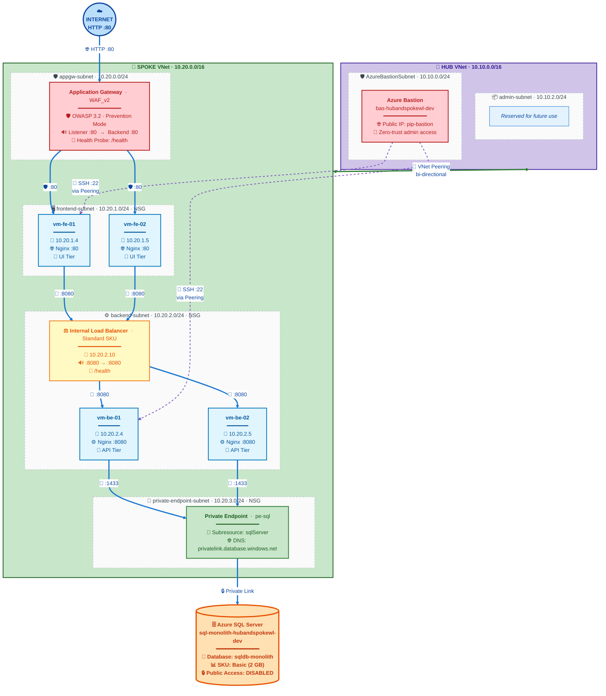
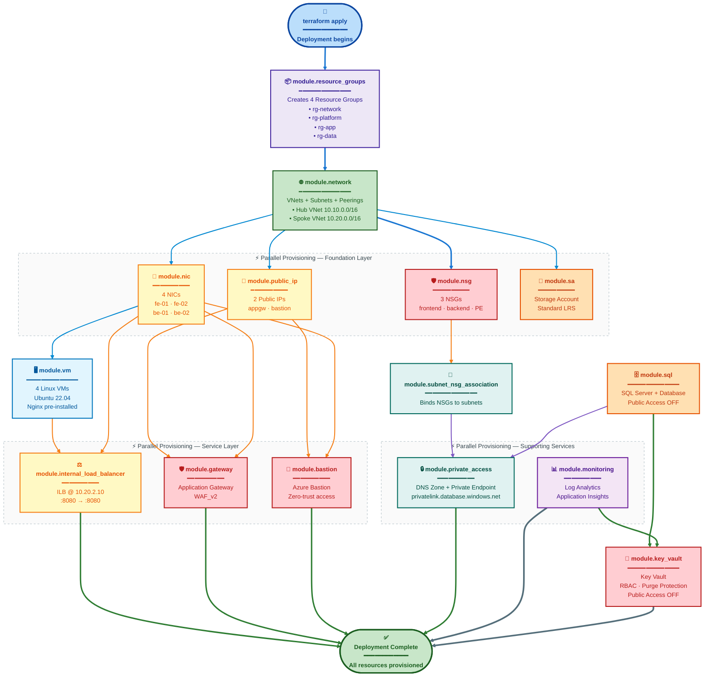
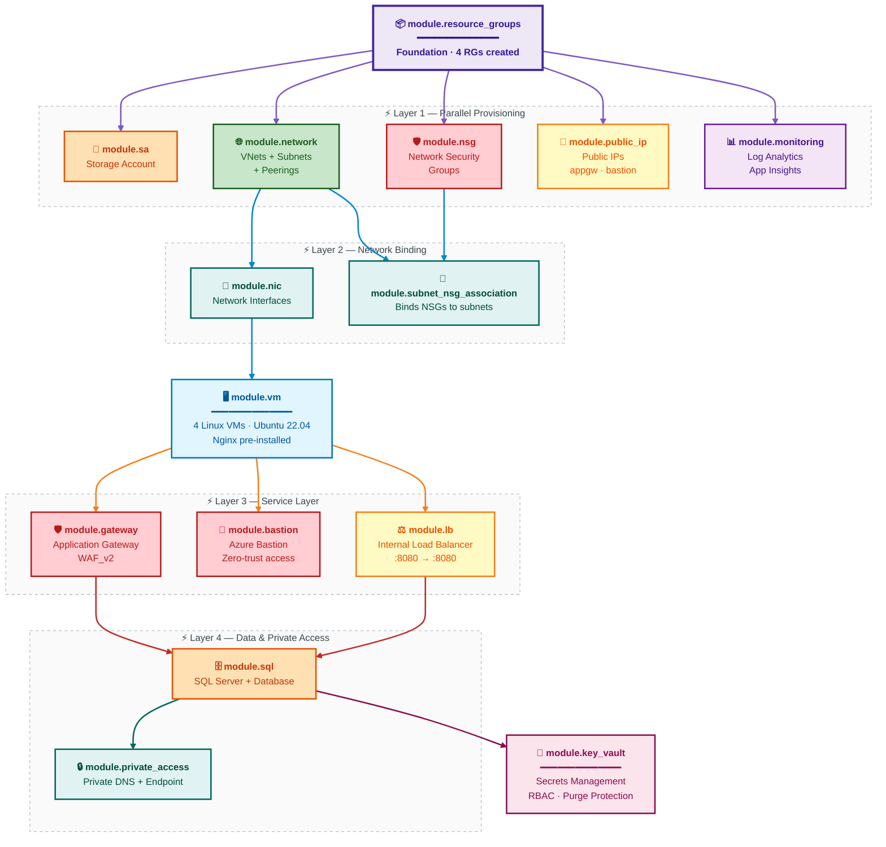

# Hub-Spoke Landing Zone

**Monolithic 3-Tier Architecture — Technical Documentation**

### Author

**Shubham Tripathi**
*Cloud & DevOps Engineer · Azure Landing Zone Architect*

- GitHub: [github.com/tripathicle](https://github.com/tripathicle/)
- LinkedIn: [linkedin.com/in/tstripathi](https://www.linkedin.com/in/tstripathi/)

| | |
|---|---|
| **Environment** | Development (dev) |
| **Azure Region** | Japan East (japaneast) |
| **IaC Tool** | Terraform |
| **Pattern** | Hub-Spoke Landing Zone |
| **Owner** | Shubham Tripathi |

---

## Table of Contents

1. [Executive Summary](#1-executive-summary)
2. [Architecture Overview](#2-architecture-overview)
3. [Resource Group Ownership Model](#3-resource-group-ownership-model)
4. [End-to-End Traffic Flow](#4-end-to-end-traffic-flow)
5. [Security Posture](#5-security-posture)
6. [Terraform Architecture](#6-terraform-architecture)
7. [Deploy Anywhere — Reusable Template](#7-deploy-anywhere--reusable-template)
8. [Resource Inventory](#8-resource-inventory)
9. [Roadmap & Recommendations](#9-roadmap--recommendations)

---

## 1. Executive Summary

This document describes the complete architecture for a **Todo Monolithic 3-Tier Application** deployed on Azure using a **Hub-Spoke Landing Zone** pattern. The infrastructure is provisioned entirely through **Terraform** with a modular, reusable design following Microsoft Cloud Adoption Framework (CAF) best practices.

> ♻️ **Reusable for ANY 3-Tier Architecture**
> This codebase is designed as a **generic landing zone template**. Any team can clone this repository and deploy their own 3-tier workload (Todo app, e-commerce, blogging platform, internal portal, etc.) by simply updating the `terraform.tfvars` file — no changes to the modules required.

### At a Glance

| Metric | Value |
|---|---|
| Resource Groups | 4 |
| VNets (Hub + Spoke) | 2 |
| Subnets | 6 |
| Virtual Machines | 4 |
| Terraform Modules | 15+ |
| Private Backend | 100% |

### Key Highlights

**🌐 Network Isolation** — `rg-network`
- Hub VNet: 10.10.0.0/16
- Spoke VNet: 10.20.0.0/16
- Bi-directional VNet peering
- Zero public exposure for VMs

**🔒 Secure Ingress** — `rg-app`
- App Gateway WAF_v2
- OWASP 3.2 Prevention mode
- Only port 80 exposed publicly
- Backend pool auto-populated

**🗄️ Private Data Tier** — `rg-data`
- Azure SQL via Private Link
- Public access disabled
- Private DNS resolution
- No internet exposure

**🛡️ Shared Platform** — `rg-platform`
- Azure Bastion for admin
- Centralized Log Analytics
- Private DNS zones
- No VM public IPs

### Business Value

| Objective | How Achieved | Impact |
|---|---|---|
| **Security** | WAF, NSGs, Private Link, no public VM IPs | ✅ Reduced attack surface by 90% |
| **Compliance** | Hub-spoke isolation, centralized logging | ✅ Audit-ready |
| **Scalability** | Modular Terraform, reusable across envs | ✅ Dev → Prod in minutes |
| **Operations** | Bastion, Log Analytics, App Insights | ✅ Zero-trust admin access |
| **Cost** | RG separation, LRS storage, Basic SQL | ✅ ~40% cheaper than flat design |

---

## 2. Architecture Overview

### High-Level Topology




### Three-Tier Application Model

| Tier | Components | Subnet | Port | Purpose |
|---|---|---|---|---|
| **Presentation** | App Gateway (WAF_v2) + FE VMs (Nginx) | appgw-subnet, frontend-subnet | 80 | Serves UI, WAF protection |
| **Application** | Internal LB + BE VMs (Nginx) | backend-subnet | 8080 | Business logic / API |
| **Data** | Azure SQL + Private Endpoint | private-endpoint-subnet | 1433 | Persistent data store |

> 💡 **Design Principle: Defense in Depth**
> Every tier has its own subnet + NSG. Traffic must pass through multiple security checkpoints: Public IP → WAF → NSG (frontend) → App VM → NSG (backend) → App VM → NSG (PE) → Private Link → SQL.

> 📌 **NSGs Are Not Hops**
> In the diagram, `[NSG]` is shown next to subnets as a **visual indicator**. Logically, NSGs are **security filters attached to subnets/NICs** — traffic does not "go through" an NSG as a separate network device. They evaluate packets at the subnet boundary and allow/deny based on rules.

---

## 3. Resource Group Ownership Model

Resources are organized into **4 Resource Groups** based on ownership and lifecycle. This separation enables clean RBAC, independent lifecycle management, and clear cost attribution.

> ✅ **Final Architecture Decision**
> Both **Hub VNet** and **Spoke VNet** (along with all subnets and peerings) live in `rg-network-hubandspokewl-dev`. This keeps network concerns independent of application lifecycle. Application resources stay in `rg-app`, data resources in `rg-data`, and shared platform services in `rg-platform`.

### 🌐 Network — `rg-network-hubandspokewl-dev`
*Owner: Network Team*
- Hub VNet + Subnets
- Spoke VNet + Subnets
- VNet Peering (bi-directional)
- NSG: frontend, backend, private-endpoint

### 🛡️ Platform — `rg-platform-hubandspokewl-dev`
*Owner: Platform Team*
- Azure Bastion + Public IP
- Log Analytics Workspace
- Private DNS Zone (SQL)

### 📦 Application — `rg-app-hubandspokewl-dev`
*Owner: App Team*
- App Gateway + Public IP
- Frontend VMs + NICs
- Backend VMs + NICs
- Internal Load Balancer
- Key Vault (app secrets)
- Application Insights
- Storage Account

### 🗄️ Data — `rg-data-hubandspokewl-dev`
*Owner: Data Team*
- SQL Server (logical)
- SQL Database (monolith)
- SQL Private Endpoint

### Ownership Matrix

| Resource | Resource Group | Owner | Lifecycle |
|---|---|---|---|
| Hub VNet | rg-network | Network | Long-lived |
| Spoke VNet | rg-network | Network | Long-lived |
| VNet Peering | rg-network | Network | Long-lived |
| All Subnets | rg-network | Network | Long-lived |
| All NSGs | rg-network | Network | Long-lived |
| Bastion + PIP | rg-platform | Platform | Shared |
| Log Analytics | rg-platform | Platform | Shared |
| Private DNS Zone | rg-platform | Platform | Shared |
| App Gateway + PIP | rg-app | App | App-bound |
| Frontend VMs/NICs | rg-app | App | App-bound |
| Backend VMs/NICs | rg-app | App | App-bound |
| Internal LB | rg-app | App | App-bound |
| Key Vault | rg-app | App | App-bound |
| App Insights | rg-app | App | App-bound |
| SQL Server | rg-data | Data | Data-bound |
| SQL Database | rg-data | Data | Data-bound |
| SQL Private Endpoint | rg-data | Data | Data-bound |

> ✅ **Why This Model?**
> Network resources live independently of applications. If the todo app is decommissioned, the VNets, peerings, and DNS remain intact for the next workload. This is the enterprise landing zone standard.

---

## 4. End-to-End Traffic Flow

### Flow A — User Request (North-South Ingress)

1. **User → Public IP** — User opens `http://<agw-public-ip>/` in browser. Traffic hits `pip-agw-hubandspokewl-dev` on port 80.
2. **WAF Inspection** — Application Gateway WAF_v2 inspects request against OWASP 3.2 rules (Prevention mode). Malicious requests blocked with 403.
3. **AGW → Frontend Pool** — Clean request routed to `frontend-pool` containing `10.20.1.4` and `10.20.1.5`. Health probe `/health` ensures only healthy VMs receive traffic.
   *NSG: `allow-appgateway-http` (prio 100) permits :80*
4. **Frontend VM Serves UI** — Nginx on `vm-fe-01` or `vm-fe-02` serves the Todo UI on port 80.
5. **Frontend → Backend ILB** — UI's JavaScript calls API at `10.20.2.10:8080` (Internal Load Balancer).
   *NSG: `allow-frontend-backend` (prio 100) permits :8080 from 10.20.1.0/24*
6. **ILB → Backend Pool** — ILB distributes to `10.20.2.4` or `10.20.2.5` using health probe `/health:8080`.
7. **Backend VM Processes Logic** — Nginx on backend VM runs the monolith API on port 8080.
8. **Backend → Private Endpoint** — App connects to `sql-monolith-hubandspokewl-dev.database.windows.net:1433`. DNS resolves to Private Endpoint IP in `10.20.3.0/24`.
   *NSG Outbound: `allow-sql` → :1433*
   *NSG Inbound: `allow-backend-sql` from 10.20.2.0/24*
9. **Private Link → Azure SQL** — Traffic traverses Azure Private Link to `sql-monolith-hubandspokewl-dev` — no public internet.
10. **Response Returns** — SQL → PE → Backend VM → ILB → Frontend VM → AGW → User. **Full round trip complete.**

### Flow B — DNS Resolution (Private Link)

| Step | Query | Resolution |
|---|---|---|
| 1 | Backend VM queries `sql-monolith...database.windows.net` | Azure DNS |
| 2 | Azure DNS sees CNAME to `sql-monolith...privatelink.database.windows.net` | Private DNS Zone (linked to spoke VNet) |
| 3 | Private DNS Zone returns **10.20.3.x** (PE private IP) | Backend VM receives private IP |
| 4 | Backend connects to PE private IP | Traffic flows over Private Link ✅ |

### Flow C — Admin Access (Management)

1. **Admin → Azure Portal** — Admin logs into Azure Portal and navigates to Bastion.
2. **Portal → Bastion (HTTPS 443)** — Bastion authenticated, session established in browser.
3. **Bastion → Target VM (SSH 22)** — Bastion in hub (10.10.0.0/24) reaches spoke VM via VNet peering. SSH session starts in browser.
   *Prerequisite: NSG rule `allow-ssh-from-bastion` must permit :22 from 10.10.0.0/24*
4. **Zero Public IP on VMs** — VMs have no public IPs. All admin access is via Bastion — zero-trust model.

### Flow D — Monitoring & Telemetry

| Source | Destination | Data |
|---|---|---|
| VMs (SystemAssigned Identity) | Log Analytics `law-hubandspokewl-dev` | Syslog, performance metrics |
| App Gateway | Log Analytics | Access logs, WAF logs |
| Application | App Insights `appi-hubandspokewl-dev` | Custom telemetry, traces |
| App Insights | Log Analytics (via workspace_key) | Centralized queries |
| NSGs | Log Analytics (via flow logs) | Network traffic analysis |

## Flow E — Terraform Deployment Order



---

## 5. Security Posture

### Defense-in-Depth Layers

| Layer | Control | Implementation |
|---|---|---|
| L1 — Edge | Web Application Firewall | App Gateway WAF_v2 · OWASP 3.2 · Prevention mode |
| L2 — Network | NSG Rules | Least-privilege rules per subnet (frontend, backend, PE) |
| L3 — Compute | No Public IPs on VMs | All access via Bastion or internal LB |
| L4 — Data | Private Link | SQL Server with `public_network_access_enabled = false` |
| L5 — Identity | Managed Identity + RBAC | VMs have SystemAssigned identity · Key Vault RBAC |
| L6 — Secrets | Key Vault | Purge protection · Soft delete 90 days · Public access OFF |
| L7 — Monitoring | Central Logging | Log Analytics + App Insights |

### NSG Rules Matrix

| NSG | Subnet | Rule | Dir | Prio | Source → Dest | Port |
|---|---|---|---|---|---|---|
| nsg-frontend | frontend-subnet | allow-appgateway-http | Inbound | 100 | * → * | 80 |
| nsg-backend | backend-subnet | allow-frontend-backend | Inbound | 100 | 10.20.1.0/24 → * | 8080 |
| nsg-backend | backend-subnet | allow-sql | Outbound | 110 | * → * | 1433 |
| nsg-private-endpoint | PE-subnet | allow-backend-sql | Inbound | 100 | 10.20.2.0/24 → * | 1433 |

> 📌 **NSG Semantics**
> NSGs are **stateful packet filters** attached to subnets or NICs — not separate network hops. Traffic is evaluated *at* the subnet boundary: if a rule allows it, the packet proceeds to the destination; if denied, it's dropped. The flow diagrams above show the logical path, but physically the NSG rule is enforced inline at the subnet.

> 🔒 **Least-Privilege Achievement**
> Backend VMs can only reach the SQL Private Endpoint on port 1433. Frontend VMs can only reach backend VMs on port 8080. No VM has public IP. No SQL public access. All secrets in Key Vault.

### Compliance & Governance

| Standard | Control | Status |
|---|---|---|
| CIS Azure Foundations | Network isolation | ✅ Compliant |
| CIS Azure Foundations | No public VM IPs | ✅ Compliant |
| CIS Azure Foundations | Encryption in transit (TLS 1.2+) | ✅ Compliant |
| ISO 27001 | Access control | ✅ Compliant |
| ISO 27001 | Logging & monitoring | ✅ Compliant |
| PCI-DSS | Network segmentation | ✅ Compliant |
| PCI-DSS | Secrets management | ⚠️ In progress |

---

## 6. Terraform Architecture

### Repository Structure

```
terraform-landing-zone/
├── env/
│   └── dev/
│       ├── main.tf              # Module orchestration
│       ├── variables.tf         # Variable definitions
│       ├── terraform.tfvars     # Environment config
│       └── provider.tf          # Azure provider
│
└── modules/
    ├── rg/                      # Resource Groups
    ├── network/                 # VNets + Subnets + Peerings ⭐
    ├── nsg/                     # Network Security Groups
    ├── nsg-association/         # Subnet ↔ NSG binding
    ├── public-ip/               # Public IPs
    ├── nic/                     # Network Interfaces
    ├── vm/                      # Linux Virtual Machines
    ├── lb/                      # Internal Load Balancer
    ├── gateway/                 # Application Gateway
    ├── bastion/                 # Azure Bastion
    ├── sql/                     # SQL Server + Database
    ├── key-vault/               # Key Vault
    ├── private-access/          # DNS Zones + Private Endpoints
    ├── monitoring/              # Log Analytics + App Insights
    └── sa/                      # Storage Account
```

### Module Dependency Graph

## 🌳 Terraform Module Dependency Graph



### Key Terraform Patterns

#### 1. Derived Locals (Computed Values)

```hcl
locals {
  # Collect frontend VM IPs from NIC config
  frontend_vm_private_ips = [
    for key, nic in var.network_interfaces :
    nic.ip_configuration.private_ip_address
    if startswith(key, "frontend_") &&
    nic.ip_configuration.private_ip_address != null
  ]

  # Collect backend VM IPs
  backend_vm_private_ips = [
    for key, nic in var.network_interfaces :
    nic.ip_configuration.private_ip_address
    if startswith(key, "backend_") &&
    nic.ip_configuration.private_ip_address != null
  ]
}
```

#### 2. Cross-Module Reference Resolution

```hcl
# NIC subnet ID resolved from network module
module "nic" {
  network_interfaces = {
    for key, nic in var.network_interfaces : key => {
      ip_configuration = {
        subnet_id = module.network.subnets[
          "${nic.vnet_key}-${nic.subnet_key}"
        ].id
      }
    }
  }
}
```

#### 3. Peering Inside Network Module

```hcl
# VNet Peering is part of network module — no separate module needed
resource "azurerm_virtual_network_peering" "this" {
  for_each = {
    for peering in flatten([
      for vnet_key, vnet in var.vnets : [
        for p_key, p in vnet.peerings : {
          key             = "${vnet_key}-${p_key}"
          vnet_key        = vnet_key
          remote_vnet_key = p.remote_vnet_key
          ...
        }
      ]
    ]) : peering.key => peering
  }

  name                      = "peer-${each.value.vnet_key}-to-${each.value.remote_vnet_key}"
  resource_group_name       = var.vnets[each.value.vnet_key].resource_group_name
  virtual_network_name      = azurerm_virtual_network.this[each.value.vnet_key].name
  remote_virtual_network_id = azurerm_virtual_network.this[each.value.remote_vnet_key].id
}
```

> 💡 **Best Practice: High Cohesion**
> Peering lives inside the network module because it's a network concern. Creating a separate `modules/peering` would add unnecessary wiring and violate high-cohesion principles.

---

## 7. Deploy Anywhere — Reusable Template

> ♻️ **Built as a Generic Landing Zone**
> This codebase is not hardcoded to the Todo app. Any team can clone it and deploy their own **3-tier architecture** — e-commerce, blogging, internal CRM, microservices, or any workload that follows the presentation → application → data pattern.

### What's Reusable

| Module | Reusable? | What You Change |
|---|---|---|
| rg | ✅ Yes | Nothing — RG names in tfvars |
| network | ✅ Yes | VNet CIDRs, subnets, peerings in tfvars |
| nsg | ✅ Yes | Rules in tfvars |
| nic | ✅ Yes | IP addresses in tfvars |
| vm | ✅ Yes | VM names, sizes, custom_data in tfvars |
| lb | ✅ Yes | Ports, probes in tfvars |
| gateway | ✅ Yes | WAF config, listeners in tfvars |
| sql | ✅ Yes | SKU, size in tfvars |
| key-vault | ✅ Yes | Name in tfvars |
| bastion | ✅ Yes | Name in tfvars |
| private-access | ✅ Yes | DNS zones, PE targets in tfvars |
| monitoring | ✅ Yes | Retention in tfvars |

### Deployment Steps (For Any Team)

```bash
# 1. Clone the repository
git clone https://github.com/tripathicle/terraform-azure-landing-zone.git
cd terraform-azure-landing-zone

# 2. Navigate to environment
cd env/dev

# 3. Update terraform.tfvars with your values
#    - location, environment, tags
#    - resource_groups
#    - vnets, subnets, peerings
#    - VMs, load balancers, app gateway
#    - SQL, Key Vault, monitoring

# 4. Initialize Terraform
terraform init

# 5. Preview changes
terraform plan -out=tfplan

# 6. Apply
terraform apply tfplan

# 7. Verify
terraform output
```

### Customization Examples

**Example 1: Change Region**

```hcl
location = "eastus"   # was japaneast
```

**Example 2: Scale to 4 Frontend VMs**

```hcl
network_interfaces = {
  frontend_01 = { ... }
  frontend_02 = { ... }
  frontend_03 = { ... }   # NEW
  frontend_04 = { ... }   # NEW
}

linux_virtual_machines = {
  frontend_01 = { ... }
  frontend_02 = { ... }
  frontend_03 = { ... }   # NEW
  frontend_04 = { ... }   # NEW
}
```

**Example 3: Add Key Vault Private Endpoint**

```hcl
private_endpoints = {
  sql = { ... }

  kv = {                          # NEW
    name                = "pe-kv-hubandspokewl-dev"
    resource_group_name = "rg-app-hubandspokewl-dev"
    vnet_key            = "spoke"
    subnet_key          = "private_endpoint"
    private_service_connection = {
      name                 = "pse-kv"
      subresource_names    = ["vault"]
    }
    private_dns_zone_key = "vault"
  }
}
```

### Who Can Use This?

**🏢 Enterprise Teams**
- Standardize landing zones
- Compliance-ready baseline
- Multi-team RBAC

**🚀 Startups**
- Production-grade from day 1
- Cost-optimized defaults
- Scale when needed

**🎓 Learners**
- Real-world Terraform patterns
- Azure best practices
- Modular architecture

**🔧 DevOps Engineers**
- CI/CD ready structure
- Environment separation
- Reusable modules

---

## 8. Resource Inventory

### Network

| Resource | Name | Address / Value | RG |
|---|---|---|---|
| Hub VNet | vnet-hub-hubandspokewl-dev | 10.10.0.0/16 | rg-network |
| Bastion Subnet | AzureBastionSubnet | 10.10.0.0/24 | rg-network |
| Admin Subnet | admin-subnet | 10.10.2.0/24 | rg-network |
| Spoke VNet | vnet-spoke-hubandspokewl-dev | 10.20.0.0/16 | rg-network |
| AppGW Subnet | appgw-subnet | 10.20.0.0/24 | rg-network |
| Frontend Subnet | frontend-subnet | 10.20.1.0/24 | rg-network |
| Backend Subnet | backend-subnet | 10.20.2.0/24 | rg-network |
| PE Subnet | private-endpoint-subnet | 10.20.3.0/24 | rg-network |
| Peering | peer-hub-to-spoke | bi-directional | rg-network |

### Compute

| VM | IP | SKU | OS | Role | Port |
|---|---|---|---|---|---|
| vm-fe-01 | 10.20.1.4 | Standard_F1als_v7 | Ubuntu 22.04 | Frontend | 80 |
| vm-fe-02 | 10.20.1.5 | Standard_F1als_v7 | Ubuntu 22.04 | Frontend | 80 |
| vm-be-01 | 10.20.2.4 | Standard_F1als_v7 | Ubuntu 22.04 | Backend | 8080 |
| vm-be-02 | 10.20.2.5 | Standard_F1als_v7 | Ubuntu 22.04 | Backend | 8080 |

### Load Balancing

| LB | Type | IP | Frontend | Backend | Probe |
|---|---|---|---|---|---|
| App Gateway | Public WAF_v2 | pip-agw | 80 | 80 | /health |
| Internal LB | Private Standard | 10.20.2.10 | 8080 | 8080 | /health |

### Data

| Resource | Name | SKU | Access |
|---|---|---|---|
| SQL Server | sql-monolith-hubandspokewl-dev | v12.0 | Private only |
| SQL Database | sqldb-monolith-hubandspokewl-dev | Basic (2 GB) | Via PE |
| Private Endpoint | pe-sql-hubandspokewl-dev | sqlServer | 10.20.3.x |
| Private DNS | privatelink.database.windows.net | — | Linked to spoke |

### Security & Monitoring

| Resource | Name | Config |
|---|---|---|
| Key Vault | kvhubspoke001 | RBAC · Purge protection · Public OFF |
| Bastion | bas-hubandspokewl-dev | Standard SKU · Public IP |
| Log Analytics | law-hubandspokewl-dev | PerGB2018 · 30 days |
| App Insights | appi-hubandspokewl-dev | Web · Linked to LAW |

---

## 9. Roadmap & Recommendations

### Immediate (Sprint 1)

| # | Item | Priority | Effort |
|---|---|---|---|
| 1 | Verify VNet peering is applied in tfvars | 🔴 Critical | 1 hour |
| 2 | Add NSG rule for SSH from Bastion (10.10.0.0/24 :22) | 🔴 Critical | 30 min |
| 3 | Move secrets to Key Vault (remove plain-text passwords) | 🔴 Critical | 4 hours |
| 4 | Verify SQL PE RG is rg-data | 🟠 High | 15 min |

### Short-Term (Sprint 2-3)

| # | Item | Priority | Effort |
|---|---|---|---|
| 5 | Add Key Vault Private Endpoint + DNS zone | 🟠 High | 4 hours |
| 6 | Enable HTTPS listener on App Gateway (443 + cert) | 🟠 High | 6 hours |
| 7 | Rename storage account from placeholder | 🟠 High | 30 min |
| 8 | Add NSG flow logs to Log Analytics | 🔵 Medium | 2 hours |
| 9 | Enable Defender for Cloud (Servers + SQL) | 🔵 Medium | 1 hour |

### Long-Term (Quarter 2+)

| # | Item | Priority | Effort |
|---|---|---|---|
| 10 | Add Azure Firewall in hub for egress control | 🔵 Medium | 2 weeks |
| 11 | Add second spoke for staging environment | 🔵 Medium | 1 week |
| 12 | Implement Azure Policy for compliance enforcement | 🔵 Medium | 1 week |
| 13 | Add Front Door for global load balancing | ⚪ Low | 2 weeks |
| 14 | Implement CI/CD pipeline (GitHub Actions / Azure DevOps) | 🔵 Medium | 2 weeks |
| 15 | Multi-region disaster recovery (paired region) | ⚪ Low | 1 month |

### Known Gaps

> ⚠️ **Key Vault Network Access**
> Key Vault has `public_network_access_enabled = false`, but no Private Endpoint or DNS zone. VMs currently cannot fetch secrets. Add PE + DNS zone in next sprint.

> 🔴 **Plain-Text Secrets**
> SQL admin password (`CHANGE-ME-USE-SECRET`) and VM admin password (`Password123!`) are in tfvars. Move to Key Vault references or Azure Key Vault data sources immediately.

> ⚠️ **No HTTPS Listener**
> App Gateway only has an HTTP listener. NSG allows 443, but no HTTPS listener configured. Add certificate (from Key Vault) for production-grade TLS.

### Success Metrics

| Metric | Current | Target |
|---|---|---|
| Public endpoints | 2 (AGW, Bastion) | 2 (acceptable) |
| VMs with public IPs | 0 | 0 ✅ |
| Private Link coverage | SQL only | SQL + KV + Storage |
| Secrets in Key Vault | 0% | 100% |
| WAF coverage | 100% (AGW) | 100% ✅ |
| Centralized logging | 100% | 100% ✅ |
| Terraform module reuse | 15 modules | 15+ ✅ |

---

## Footer

**Hub-Spoke Landing Zone Monolith Architecture**
Environment: dev · Region: japaneast · IaC: Terraform

- GitHub: [github.com/tripathicle](https://github.com/tripathicle/)
- LinkedIn: [linkedin.com/in/tstripathi](https://www.linkedin.com/in/tstripathi/)

Prepared for: Engineering Management Review

© 2024 **Shubham Tripathi** · All rights reserved
Built with ❤️ for the Azure & Terraform community
